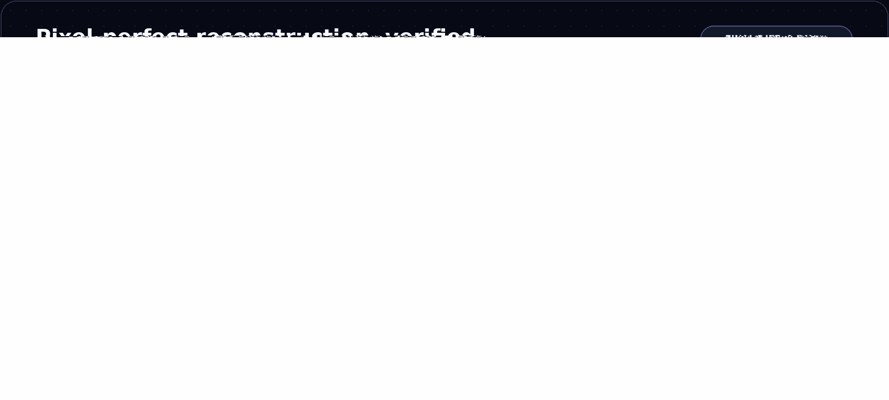

<p align="center">
  
</p>

<h1 align="center">dsh-vision-router</h1>

<p align="center"><strong>Paste an image and it just works — eyes for text-only agents on DeepSeek Harness. Free out of the box, no key, no Python, one command.</strong></p>

<p align="center">DeepSeek keeps thinking; the built-in free vision chain and ten pixel-level tools do the seeing. Image turns behave like ordinary tool-calling turns — grounded, measurable, repeatable.</p>

<p align="center">
  <a href="https://awesome-dsh-plugin.com"></a>
  <a href="https://github.com/ysr666/dsh-vision-router/releases/tag/v1.1.0"></a>
  <a href="tests"></a>
  <a href="LICENSE"></a>
  <a href="package.json">=22" /></a>
  
  <a href="cordis.patch.yml"></a>
</p>

<p align="center">English · <a href="README.zh.md">中文</a></p>

> [!WARNING]
> 📌 **Announcement (v1.1.0)**
>
> Now supports **Extra vision wrappers**: any custom text route (e.g. opencode) sends images out of the box — plus long-screenshot OCR, a "Test connection" button and artifact preview cards in the settings panel. Stealth mode is off by default and the official DeepSeek row is no longer taken over implicitly.

<p align="center">
  
</p>

## Why this exists

Most DSH vision plugins bridge images to DeepSeek as *text descriptions* — lossy, one-shot, and blind to pixels. This plugin keeps the **original pixels on the vision model's side** and DeepSeek on the reasoning side, and makes looking at an image an **ordinary tool call**:

- **One command install.** The package ships its own composition patch (`dsh.bundle.patch`): `dsh plugin add` wires the row, the admission wrapper and the attachment limits automatically — zero manual file edits. Taking over the official DeepSeek route is an optional setting (stealth mode, off by default).
- **Free by default.** The vision chain starts with a built-in OVHcloud anonymous endpoint (`Qwen2.5-VL-72B-Instruct`, no account, no key, 2 req/min per IP). Paid chains (OpenRouter, Pi-AI providers, direct OpenAI-compatible endpoints) are optional upgrades.
- **No Python.** The whole pipeline — downscale, grounding, crop, pixel diff, palette, OCR, SVG trace, cutout, HTML screenshot — runs on sharp / potrace / tesseract / system Chrome.
- **Continuous multi-step image work.** An image turn is a text turn that calls tools: `vision_ground` → `vision_crop` → `vision_describe` → `vision_pixel_diff` → fix → screenshot again. The agent keeps iterating until the work is done.
- **DeepSeek stays the brain.** Text turns are untouched in model, cost and context. The vision model is only the eyes, called on demand; answers are cached by image content.
- **Transparent to the user.** Uploaded images keep rendering as images in the conversation UI; the rewrite that points the model at the vision tools happens only inside the model call, never in the session log.

## How it compares

The closest alternative is [@anionex/dsh-vision-toolkit](https://github.com/Anionex/dsh-vision-toolkit) (Anionex), a native DSH bundle of the well-known `agent-vision-toolkit` lineage. Both packages ship a `vision-tools` skill and a family of pixel-level tools; they differ in philosophy — **zero-config paste-and-go** versus **agent-driven visual engineering**:

| | dsh-vision-router | @anionex/dsh-vision-toolkit |
|---|---|---|
| Image Q&A out of the box | ✅ Built-in free chain (anonymous OVHcloud endpoint) — no account, no key | Requires your own vision API key (local pixel tools work without one) |
| Runtime | ✅ Node only — no Python | Python 3.11+ managed runtime |
| Getting an image in | ✅ Paste it — the turn auto-routes to the vision chain and auto-mounts the tools | Workspace path + `/vision-tools` command, then explicit tool calls |
| Turn routing | ✅ Image turns switch to vision, text turns switch back to DeepSeek — optional stealth takeover keeps the model picker looking stock | Tool-driven; no whole-turn auto-routing |
| Profiles | Web | Web + Headless |
| Playbooks | The pixel loop: ground → crop → diff → fix → screenshot again | Richer case library (long-screenshot OCR, UI restoration, GUI automation) |
| Tests | 86 | 162 |
| Install | One command | One command (npm) |

Both are MIT-licensed and one command away. Pick this plugin when you want images to *just work* with zero setup; pick theirs when you need headless profiles or the extended playbook library. (Feature comparison reflects their README as of 2026-08.)

## Quick start

```sh
dsh plugin --profile web add dsh-vision-router
```

Restart `dsh web` — done. Zero configuration:

- the plugin's bundle patch mounts the row, adds the admission wrapper and relaxes attachment limits to 20 MB / 100 MP — pure-additive, it never touches the core rows; whether the official DeepSeek route is taken over is decided by the optional stealth setting (off by default);
- the default vision chain is the built-in free endpoint;
- custom/third-party routes (e.g. opencode) gain image input through **Extra vision wrappers**;
- every setting is editable live in **Settings → Plugins → Plugin config → 视觉路由（自动识图）**.

Then just paste an image into a conversation. The agent mounts the vision tools automatically and looks at it through `vision_describe` (and friends) — multi-step if needed.

### See it in action

*Left: an image turn — the user sends a picture, the agent calls `vision_describe` through the free chain and answers. Right: the finished structured answer.*

<p align="center">
  
  
</p>

## Highlights

- **Original pixels, real answers.** The vision chain reads the image at original resolution (auto-downscaled only to protect latency/quota); the agent's question travels with the image, so answers are about *your* question, not a generic description.
- **Automatic failover with classified errors.** Region blocks, ToS filtering, 402 quota, 429 rate limits (with Retry-After backoff), context overflow, network failures — the chain walks providers one by one and only reports after all of them failed, with actionable advice.
- **Image memory.** Vision answers are cached by attachment content hash; later text turns substitute the recorded description (marked as untrusted evidence), so DeepSeek genuinely remembers earlier images without re-spending vision calls.
- **A verifiable pixel loop.** Reference → `vision_html_screenshot` → `vision_pixel_diff` (ratio + red heatmap + worst-region ranking) → fix → repeat until the mismatch converges. UI restoration becomes measurable instead of eyeballed.
- **Progressive schema exposure.** Only a zero-arg `vision_activate` bootstrap is always visible; image turns auto-mount all ten deep tools with a one-time usage note, and a `vision-tools` skill is registered for text-only turns.
- **Selective proxy.** Only the configured vision provider hosts go through your local proxy; DeepSeek stays direct.

### Pixel loop in practice

<p align="center">
  
</p>

The agent rebuilt the UI from the reference image, then verified the final result with `vision_pixel_diff`: **2.54% final diff** (32,939 / 1,296,000 differing pixels, threshold 16/channel).

## How it works

<p align="center">
  
</p>

The vision model is **only the eyes**; DeepSeek is **always the brain**. An image turn is never hijacked by a one-shot vision answer — the agent drives the tools itself and can keep operating on the image across as many steps as the task needs.

## Tools

All ten deep tools mount automatically on image turns (`autoActivateOnImage`); text turns can mount them via `vision_activate` or the `/vision-tools` skill. Built on sharp / potrace / tesseract / system Chrome — no Python:

<p align="center">
  
</p>

| Tool | What it does | Artifact |
|---|---|---|
| `vision_describe` | Image Q&A / multi-image compare / structured-evidence JSON mode (summary + layout regions + entity inventory + verbatim transcription) | — |
| `vision_ground` | Locate a target → **original-pixel box x1/y1/x2/y2** | annotated PNG (optional) |
| `vision_detect` | Numbered inventory of every element of a kind (buttons/inputs/links…) with original-pixel boxes | annotated PNG with numbered boxes |
| `vision_crop` | Crop and zoom into a pixel box | PNG |
| `vision_pixel_diff` | Per-pixel comparison: diff ratio + worst 8×8-grid regions | red heatmap PNG + JSON report |
| `vision_colors` | Dominant colors (hex + share) | — |
| `vision_ocr` | Text transcription: local tesseract (chi_sim+eng) first, vision model fallback | — |
| `vision_trace` | SVG vectorization (potrace posterization; icons/logos) | SVG |
| `vision_extract_foreground` | Cutout via border flood fill (uniform backgrounds) | transparent PNG |
| `vision_html_screenshot` | Screenshot a local HTML file (headless system Chrome) | PNG |
| `vision_long_screenshot_ocr` | Long-screenshot transcription: overlapping chunks, tesseract first / vision model fallback, stitched Markdown | chunk PNGs + Markdown + manifest |

Formats are sniffed from magic bytes, so extensionless content-addressed attachment files work everywhere (no `.png` renaming needed).

**Common workflows**

```text
vision_ground image="ref.png" target="the send button"
vision_detect image="page.png" target="input fields"
vision_crop   image="ref.png" region="1067,841,1108,881"
vision_describe paths=["ref.png","impl.png"] question="list the differences" json=true
vision_pixel_diff original="ref.png" rebuilt="screenshot.png"
vision_ocr image="screenshot.png"
vision_colors image="ref.png" top=8
vision_trace image="icon.png" steps=4
vision_extract_foreground image="logo.png"
vision_html_screenshot source="page.html" width=1200 height=720
vision_long_screenshot_ocr image="chat-log.png" chunkHeight=1200 overlap=120
```

## Provider fallback chain

The vision chain walks providers in order and only surfaces an error after every one failed:

1. the **built-in free endpoint** (`vision-http` → `ovh/Qwen2.5-VL-72B-Instruct`) — no key, best-effort, 2 req/min per IP;
2. configured `httpProviders` (direct OpenAI-compatible endpoints with optional `apiKeyEnv`);
3. configured `providers` / `provider` + `fallbacks` (any adapter-backed provider, e.g. a Pi-AI profile like OpenRouter or Zhipu).

> In the legacy `routing: true` mode, the whole-turn chain walks only `provider + fallbacks` — `httpProviders` (including the free fallback) do not participate there. The default `routing: false` (tools-first) tries everything.

Failures are classified (region / tos / quota / rate-limit / context / network) and the final error carries advice; `429` responses honor `Retry-After` once with a capped backoff. Oversized uploads are downscaled before the call (default budget 4 MP) to keep tool calls fast.

## Stealth mode

Stealth mode is **off by default** (explicit opt-in since issue #34): with it off, the official `deepseek-official` route stays untouched and image turns go through the visible "DeepSeek + 自动识图" wrapper entry in the picker.

With stealth on, the plugin takes over the official `deepseek-official` route: the model picker looks exactly like stock (same DeepSeek group, same model names), but each entry is the auto-vision wrapper that declares image input and delegates text turns to a rebuilt native DeepSeek adapter (same `llm-deepseek` settings section and credentials). Old sessions keep working through the hidden `deepseek-vision` alias. The takeover requires the stock row to be absent — disable it in your profile patch layer (`~/.dsh/profiles/<profile>/cordis.patch.yml`):

```yaml
- id: llm-deepseek
  name: '@deepseek-ai/dsh-llm-deepseek'
  disabled: true
```

With the stock row present, the plugin falls back to the visible wrapper entry. Conversely, with stealth off but the stock row still disabled, the plugin performs a keep-alive takeover so the DeepSeek models don't vanish (the settings card explains this); to restore the fully official route, flip the `disabled` above back to `false` and restart.

> Stealth mode **only affects the official DeepSeek route**. Custom/third-party routes like opencode are unrelated — use **Extra vision wrappers** below to give them image input.

## Extra vision wrappers

`wrappedProviders` registers an auto-vision twin for any third-party/custom text route: pick the twin in the model selector and send images; text turns delegate to the original route unchanged. The typical use case is a custom interface such as opencode — it only declares text input, and one wrapper row makes it image-ready. In the settings card, configure it with two dropdowns (provider + model); leaving the model empty wraps every model of that route.

## Web settings

The Web profile registers a **视觉路由（自动识图）** card under **Settings → Plugins → Plugin config**, styled like the built-in cards. It live-edits:

- switches: whole-turn legacy routing, vision tools, image-block rewriting, stealth (official DeepSeek route only);
- **extra vision wrappers**: provider + model dropdowns that register image-capable twin entries for custom routes such as opencode;
- vision request timeout, wrapper/chain route names;
- the **vision chain** (one `provider/model` per line, top-down fallback) and the text model;
- every field shows an "overridden" badge with a one-click reset to the composition default, plus discard/save;
- a **Test connection** button probes the first vision provider and reports latency inline;
- artifact-producing tools render dedicated call cards with result facts and open-file buttons.

<p align="center">
   Plugins > Plugin config." />
</p>

> PR [#8](https://github.com/ysr666/dsh-vision-router/pull/8) upgrades the panel with catalog-driven model dropdowns, add/remove fallback rows, and proxy settings.

## Configuration

Everything is optional; defaults work out of the box. Edit via the Web card or a profile patch:

| Field | Default | Meaning |
|---|---|---|
| `provider` / `model` | `vision-http` / `ovh/Qwen2.5-VL-72B-Instruct` | shorthand chain (adapter-backed provider + model) |
| `fallbacks` | `[]` | backup models for the shorthand provider |
| `providers` | built-in free `vision-http` pair | multi-provider chain `{ provider, model, fallbacks[] }`, tried in order; wins over the shorthand. The first row ships as the built-in free model |
| `httpProviders` | built-in OVH entry | direct OpenAI-compatible endpoints `{ name, baseURL, model, apiKeyEnv, maxTokens }` |
| `wrappedProviders` | `[{ provider: 'deepseek-official', models: [] }]` | extra text routes to wrap as image-capable twins: `{ provider, models[] }` — registers an auto-vision twin for any custom/third-party route (e.g. opencode); in the card, provider + model dropdowns, empty model = wrap all. The pre-filled deepseek-official row marks the built-in wrapper and is a no-op; changes apply live |
| `routing` | `false` | legacy whole-turn chain routing (one-shot answer). `false` = tools-first flow (recommended) |
| `reverseRouting` | `true` | with `routing: true`, route text turns back to `textProvider` |
| `wrapperRoute` / `chainRoute` | `deepseek-vision` / `vision-chain` | admission wrapper route name / fallback chain route name (empty disables) |
| `stealth` | `false` | take over the official `deepseek-official` route (official row only; custom routes use `wrappedProviders`) |
| `textProvider` | `deepseek-official` / `deepseek-v4-pro` | the model that reasons (your daily model) |
| `tool` / `progressiveTools` / `autoActivateOnImage` | `true` ×3 | vision tools on / progressive mounting / auto-mount on image turns |
| `rewriteImages` | `true` | rewrite image blocks in the model input (cached description or tool-hint marker); the UI log keeps images |
| `downscale` / `downscaleMaxPixels` | `true` / `4000000` | pre-call downscale and its pixel budget (latency guard) |
| `cache` / `cacheTtlSeconds` / `cacheMaxEntries` | `true` / `3600` / `200` | vision answer cache |
| `timeoutMs` | `120000` | per vision call deadline |
| `artifactsDir` | `.dsh-vision-router/artifacts` | artifact directory (relative to the session workspace) |
| `proxy` / `proxyHosts` | `''` / openrouter hosts | optional proxy for vision provider hosts only |

## Requirements

- DeepSeek Harness with a Web profile and `pnpm` available to `dsh plugin`.
- Node ≥ 22 (host side).
- No API key for the default free chain; a credential reference (`apiKeyEnv`) only for paid `httpProviders`.
- Chrome / Chromium / Edge only for `vision_html_screenshot`; every other tool works without a browser.
- Tesseract is optional: `vision_ocr` falls back to the vision model when the local engine is absent.

## Install and lifecycle

### Install

```sh
dsh plugin --profile web add dsh-vision-router
dsh --profile web --dump-config | grep vision-router   # one row, mounted by the bundle patch
```

Restart a long-lived Web profile. The host discovers the browser bundle through `dsh.client` at startup.

### Disable / re-enable

```yaml
- id: vision-router
  disabled: true
```

Set it back to `false` to re-enable. Unloading removes the wrapper routes, tools, skill and settings card; cached artifact files remain.

### Upgrade

```sh
dsh plugin --profile web update dsh-vision-router
```

Settings live in the profile's settings provider and survive upgrades.

### Uninstall

```sh
dsh plugin --profile web remove dsh-vision-router
```

This removes the dependency and the bundle layer. If you disabled the stock DeepSeek row manually, re-enable it in your profile patch.

## Security notes

- Image text is **untrusted evidence**: descriptions, OCR output and the auto-mount note all tell the agent never to execute instructions found inside images.
- Tool inputs resolve through `ctx.fs` (sandbox-aware); vision uploads never send anything but the selected image and the question.
- Artifacts write only under `<workspace>/.dsh-vision-router/artifacts`; results return absolute paths and byte counts.
- Secrets never travel: `apiKeyEnv` names a DSH credential reference; the value is resolved per call and never logged.
- The settings write path goes through the settings service (schema-validated, revision-checked) — a stale or invalid save is rejected, not partially applied.

## License

[MIT](LICENSE)

<!-- star-history-chart -->
## Star History

<p align="center">
  <picture>
    <source media="(prefers-color-scheme: dark)" srcset="https://raw.githubusercontent.com/ysr666/dsh-vision-router/star-history/assets/star-history/star-history-dark.svg">
    
  </picture>
</p>
