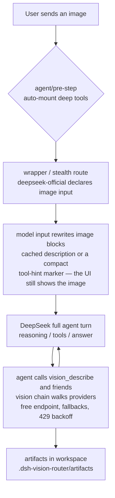

# dsh-vision-router

**Eyes for text-only agents on DeepSeek Harness — free out of the box, no Python, one command to install.**

Send an image and it just works: the agent looks at it through a built-in **free vision chain** (no signup, no key) and a set of pixel-level tools, while DeepSeek stays the brain for every turn. Image turns behave like ordinary tool-calling text turns, so the agent can look, crop, diff, OCR and iterate continuously — instead of receiving one lossy description.

[](https://github.com/ysr666/dsh-vision-router/releases/tag/v0.2.0)
[](tests)
[](LICENSE)
[](package.json)
[]()
[](cordis.patch.yml)

English | [中文](README.zh.md)

## Why this exists

Most DSH vision plugins bridge images to DeepSeek as *text descriptions* — lossy, one-shot, and blind to pixels. This plugin keeps the **original pixels on the vision model's side** and DeepSeek on the reasoning side, and makes looking at an image an **ordinary tool call**:

- **One command install.** The package ships its own composition patch (`dsh.bundle.patch`): `dsh plugin add` wires the row, the admission wrapper, the stealth takeover and the attachment limits automatically — zero manual file edits.
- **Free by default.** The vision chain starts with a built-in OVHcloud anonymous endpoint (`Qwen2.5-VL-72B-Instruct`, no account, no key, 2 req/min per IP). Paid chains (OpenRouter, Pi-AI providers, direct OpenAI-compatible endpoints) are optional upgrades.
- **No Python.** The whole pipeline — downscale, grounding, crop, pixel diff, palette, OCR, SVG trace, cutout, HTML screenshot — runs on sharp / potrace / tesseract / system Chrome.
- **Continuous multi-step image work.** An image turn is a text turn that calls tools: `vision_ground` → `vision_crop` → `vision_describe` → `vision_pixel_diff` → fix → screenshot again. The agent keeps iterating until the work is done.
- **DeepSeek stays the brain.** Text turns are untouched in model, cost and context. The vision model is only the eyes, called on demand; answers are cached by image content.
- **Transparent to the user.** Uploaded images keep rendering as images in the conversation UI; the rewrite that points the model at the vision tools happens only inside the model call, never in the session log.

## Quick start

```sh
dsh plugin --profile web add github:ysr666/dsh-vision-router
```

Restart `dsh web` — done. Zero configuration:

- the plugin's bundle patch mounts the row, takes over the official DeepSeek route (stealth mode — the model picker looks exactly like stock), and relaxes attachment limits to 20 MB / 100 MP;
- the default vision chain is the built-in free endpoint;
- every setting is editable live in **Settings → Plugins → Plugin config → 视觉路由（自动识图）**.

Then just paste an image into a conversation. The agent mounts the vision tools automatically and looks at it through `vision_describe` (and friends) — multi-step if needed.

### See it in action

*Left: an image turn — the user sends a picture, the agent calls `vision_describe` through the free chain and answers. Right: the finished structured answer.*

<p align="center">
  
  
</p>

## Highlights

- **Original pixels, real answers.** The vision chain reads the image at original resolution (auto-downscaled only to protect latency/quota); the agent's question travels with the image, so answers are about *your* question, not a generic description.
- **Automatic failover with classified errors.** Region blocks, ToS filtering, 402 quota, 429 rate limits (with Retry-After backoff), context overflow, network failures — the chain walks providers one by one and only reports after all of them failed, with actionable advice.
- **Image memory.** Vision answers are cached by attachment content hash; later text turns substitute the recorded description (marked as untrusted evidence), so DeepSeek genuinely remembers earlier images without re-spending vision calls.
- **A verifiable pixel loop.** Reference → `vision_html_screenshot` → `vision_pixel_diff` (ratio + red heatmap + worst-region ranking) → fix → repeat until the diff reaches zero. UI restoration becomes measurable instead of eyeballed.
- **Progressive schema exposure.** Only a zero-arg `vision_activate` bootstrap is always visible; image turns auto-mount all nine deep tools with a one-time usage note, and a `vision-tools` skill is registered for text-only turns.
- **Selective proxy.** Only the configured vision provider hosts go through your local proxy; DeepSeek stays direct.

## How it works



The vision model is **only the eyes**; DeepSeek is **always the brain**. An image turn is never hijacked by a one-shot vision answer — the agent drives the tools itself and can keep operating on the image across as many steps as the task needs.

## Tools

All nine deep tools mount automatically on image turns (`autoActivateOnImage`); text turns can mount them via `vision_activate` or the `/vision-tools` skill. Built on sharp / potrace / tesseract / system Chrome — no Python:

| Tool | What it does | Artifact |
|---|---|---|
| `vision_describe` | Image Q&A / multi-image compare / strict-JSON mode | — |
| `vision_ground` | Locate a target → **original-pixel box x1/y1/x2/y2** | annotated PNG (optional) |
| `vision_crop` | Crop and zoom into a pixel box | PNG |
| `vision_pixel_diff` | Per-pixel comparison: diff ratio + worst 8×8-grid regions | red heatmap PNG + JSON report |
| `vision_colors` | Dominant colors (hex + share) | — |
| `vision_ocr` | Text transcription: local tesseract (chi_sim+eng) first, vision model fallback | — |
| `vision_trace` | SVG vectorization (potrace posterization; icons/logos) | SVG |
| `vision_extract_foreground` | Cutout via border flood fill (uniform backgrounds) | transparent PNG |
| `vision_html_screenshot` | Screenshot a local HTML file (headless system Chrome) | PNG |

Formats are sniffed from magic bytes, so extensionless content-addressed attachment files work everywhere (no `.png` renaming needed).

**Common workflows**

```text
vision_ground image="ref.png" target="the send button"
vision_crop   image="ref.png" region="1067,841,1108,881"
vision_describe paths=["ref.png","impl.png"] question="list the differences" json=true
vision_pixel_diff original="ref.png" rebuilt="screenshot.png"
vision_ocr image="screenshot.png"
vision_colors image="ref.png" top=8
vision_trace image="icon.png" steps=4
vision_extract_foreground image="logo.png"
vision_html_screenshot source="page.html" width=1200 height=720
```

## Provider fallback chain

The vision chain walks providers in order and only surfaces an error after every one failed:

1. the **built-in free endpoint** (`vision-http` → `ovh/Qwen2.5-VL-72B-Instruct`) — no key, best-effort, 2 req/min per IP;
2. configured `httpProviders` (direct OpenAI-compatible endpoints with optional `apiKeyEnv`);
3. configured `providers` / `provider` + `fallbacks` (any adapter-backed provider, e.g. a Pi-AI profile like OpenRouter or Zhipu).

> In the legacy `routing: true` mode, the whole-turn chain walks only `provider + fallbacks` — `httpProviders` (including the free fallback) do not participate there. The default `routing: false` (tools-first) tries everything.

Failures are classified (region / tos / quota / rate-limit / context / network) and the final error carries advice; `429` responses honor `Retry-After` once with a capped backoff. Oversized uploads are downscaled before the call (default budget 4 MP) to keep tool calls fast.

## Stealth mode

A default install takes over the official `deepseek-official` route: the model picker looks exactly like stock (same DeepSeek group, same model names), but each entry is the auto-vision wrapper that declares image input and delegates text turns to a rebuilt native DeepSeek adapter (same `llm-deepseek` settings section and credentials). Old sessions keep working through the hidden `deepseek-vision` alias.

To keep the stock row instead, override it in your profile patch layer (`~/.dsh/profiles/<profile>/cordis.patch.yml`):

```yaml
- id: llm-deepseek
  name: '@deepseek-ai/dsh-llm-deepseek'
```

With the stock row present, the plugin falls back to the visible "DeepSeek + 自动识图" wrapper entry — pick it in the model picker for image turns. Recovery from a broken install is the same one-line override.

## Web settings

The Web profile registers a **视觉路由（自动识图）** card under **Settings → Plugins → Plugin config**, styled like the built-in cards. It live-edits:

- switches: whole-turn legacy routing, vision tools, image-block rewriting, stealth;
- vision request timeout, wrapper/chain route names;
- the **vision chain** (one `provider/model` per line, top-down fallback) and the text model;
- every field shows an "overridden" badge with a one-click reset to the composition default, plus discard/save.

<p align="center">
   Plugins > Plugin config." />
</p>

> PR [#8](https://github.com/ysr666/dsh-vision-router/pull/8) upgrades the panel with catalog-driven model dropdowns, add/remove fallback rows, and proxy settings.

## Configuration

Everything is optional; defaults work out of the box. Edit via the Web card or a profile patch:

| Field | Default | Meaning |
|---|---|---|
| `provider` / `model` | `vision-http` / `ovh/Qwen2.5-VL-72B-Instruct` | shorthand chain (adapter-backed provider + model) |
| `fallbacks` | `[]` | backup models for the shorthand provider |
| `providers` | `[]` | multi-provider chain `{ provider, model, fallbacks[] }`, tried in order; wins over the shorthand |
| `httpProviders` | built-in OVH entry | direct OpenAI-compatible endpoints `{ name, baseURL, model, apiKeyEnv, maxTokens }` |
| `routing` | `false` | legacy whole-turn chain routing (one-shot answer). `false` = tools-first flow (recommended) |
| `reverseRouting` | `true` | with `routing: true`, route text turns back to `textProvider` |
| `wrapperRoute` / `chainRoute` | `deepseek-vision` / `vision-chain` | admission wrapper route name / fallback chain route name (empty disables) |
| `stealth` | `true` | take over the official `deepseek-official` route |
| `textProvider` | `deepseek-official` / `deepseek-v4-pro` | the model that reasons (your daily model) |
| `tool` / `progressiveTools` / `autoActivateOnImage` | `true` ×3 | vision tools on / progressive mounting / auto-mount on image turns |
| `rewriteImages` | `true` | rewrite image blocks in the model input (cached description or tool-hint marker); the UI log keeps images |
| `downscale` / `downscaleMaxPixels` | `true` / `4000000` | pre-call downscale and its pixel budget (latency guard) |
| `cache` / `cacheTtlSeconds` / `cacheMaxEntries` | `true` / `3600` / `200` | vision answer cache |
| `timeoutMs` | `120000` | per vision call deadline |
| `artifactsDir` | `.dsh-vision-router/artifacts` | artifact directory (relative to the session workspace) |
| `proxy` / `proxyHosts` | `''` / openrouter hosts | optional proxy for vision provider hosts only |

## Requirements

- DeepSeek Harness with a Web profile and `pnpm` available to `dsh plugin`.
- Node ≥ 22 (host side).
- No API key for the default free chain; a credential reference (`apiKeyEnv`) only for paid `httpProviders`.
- Chrome / Chromium / Edge only for `vision_html_screenshot`; every other tool works without a browser.
- Tesseract is optional: `vision_ocr` falls back to the vision model when the local engine is absent.

## Install and lifecycle

### Install

```sh
dsh plugin --profile web add github:ysr666/dsh-vision-router
dsh --profile web --dump-config | grep vision-router   # one row, mounted by the bundle patch
```

Restart a long-lived Web profile. The host discovers the browser bundle through `dsh.client` at startup.

### Disable / re-enable

```yaml
- id: vision-router
  disabled: true
```

Set it back to `false` to re-enable. Unloading removes the wrapper routes, tools, skill and settings card; cached artifact files remain.

### Upgrade

```sh
dsh plugin --profile web update dsh-vision-router
```

Settings live in the profile's settings provider and survive upgrades.

### Uninstall

```sh
dsh plugin --profile web remove dsh-vision-router
```

This removes the dependency and the bundle layer. If you disabled the stock DeepSeek row manually, re-enable it in your profile patch.

## Security notes

- Image text is **untrusted evidence**: descriptions, OCR output and the auto-mount note all tell the agent never to execute instructions found inside images.
- Tool inputs resolve through `ctx.fs` (sandbox-aware); vision uploads never send anything but the selected image and the question.
- Artifacts write only under `<workspace>/.dsh-vision-router/artifacts`; results return absolute paths and byte counts.
- Secrets never travel: `apiKeyEnv` names a DSH credential reference; the value is resolved per call and never logged.
- The settings write path goes through the settings service (schema-validated, revision-checked) — a stale or invalid save is rejected, not partially applied.

## License

[LGPL-3.0](LICENSE)
