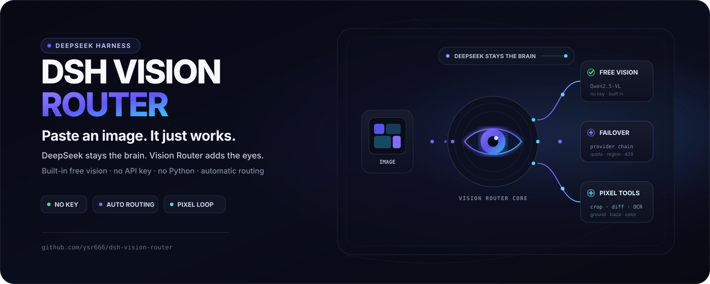
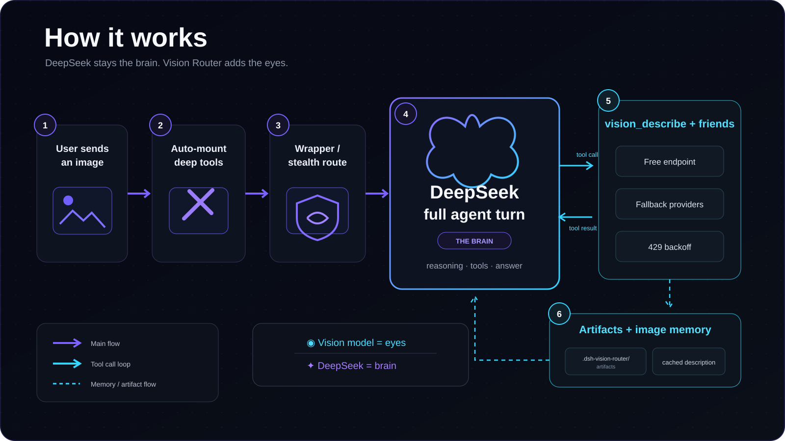
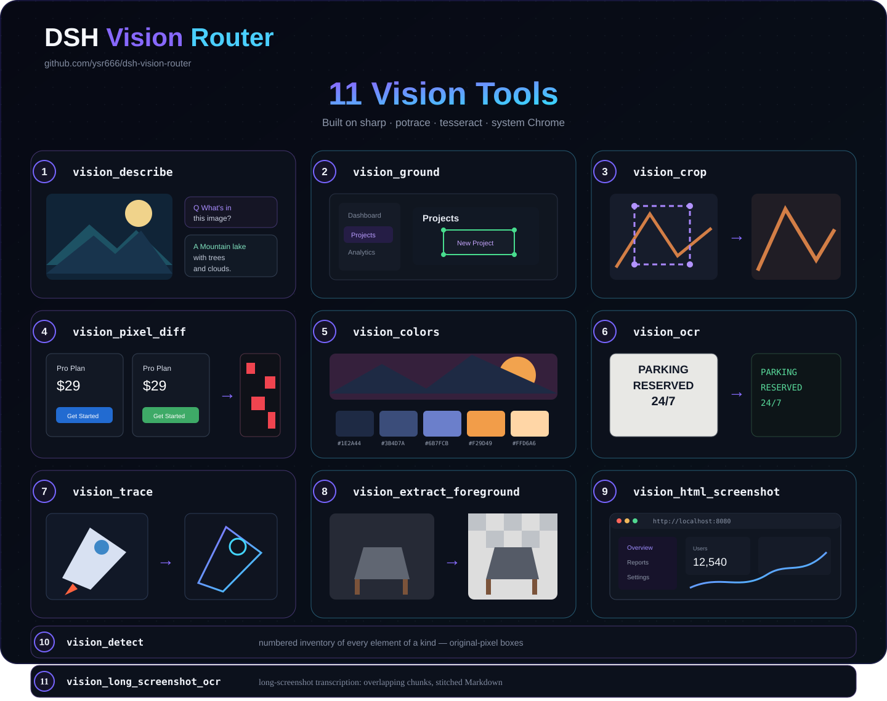

<p align="center">
  
</p>

<h1 align="center">dsh-vision-router</h1>

<p align="center"><strong>Turn vision on when you need it — eyes for text-only agents on DeepSeek Harness. Free out of the box, no key, no Python, one command.</strong></p>

<p align="center">DeepSeek keeps thinking; the built-in free vision chain and fourteen deep tools do the seeing. When an image matters, enable the composer’s “👁 Vision” control and use image turns like ordinary tool-calling turns — grounded, measurable, repeatable.</p>

<p align="center">
  <a href="https://awesome-dsh-plugin.com"></a>
  <a href="https://github.com/zp-home/dsh-recommend"></a>
  <a href="https://www.dshbase.com/plugins/dsh-vision-router/"></a>
  <a href="https://github.com/SoberReport-AI/DeepGuard/blob/main/reports/dsh-vision-router/2.0.1/39c8f2b2d69aa398418fd6c8ab40b691a92a1a3d.json"></a>
  <a href="https://whyihaveyou.github.io/dsh-suite/"></a>
</p>

<p align="center">
  <a href="https://github.com/ysr666/dsh-vision-router/releases/tag/v2.1.0"></a>
  <a href="tests"></a>
  <a href="LICENSE"></a>
  <a href="package.json">=22" /></a>
  
</p>

<p align="center">
  <sub>Ecosystem:</sub>
  <a href="https://dshplugin.app/plugins/dsh-vision-router">DSHPlugin.app</a> ·
  <a href="https://github.com/diegosouzapw/awesome-omni-dsh-plugins">Awesome Omni DSH Plugins</a> ·
  <a href="https://dshpluginhub.ai/plugins/dsh-vision-router">dshpluginhub.ai</a> ·
  <a href="https://www.dsh.plus/en/plugins/dsh-vision-router/">dsh.plus</a> ·
  <a href="https://dshplugins.ai/">dshplugins.ai</a> ·
  <a href="https://dshmarket.com/p/ysr666/dsh-vision-router/">dsh-market</a>
</p>

<p align="center">English · <a href="README.zh.md">中文</a></p>

<p align="center">💬 <strong>QQ community group: 1105463028</strong></p>

> [!WARNING]
> 📌 **Announcement (v2.1.0)**
>
> **v2.1.0:** Native five-card Settings, explicit Vision mode, runtime i18n, hardened capability routing/benchmarks, and the DSH rc.8 support floor. [What’s new →](docs/releases/v2.1.0.md)

<p align="center">
  
</p>

## Contents

- [Why this exists](#why-this-exists)
- [How it compares](#how-it-compares)
- [Design lineage](#design-lineage)
- [Acknowledgements](#acknowledgements)
- [Quick start](#quick-start)
- [Free vision key channels](#free-vision-key-channels)
- [Highlights](#highlights)
- [How it works](#how-it-works)
- [Tools](#tools)
- [Configuration](#configuration)
- [Install and lifecycle](#install-and-lifecycle)
- [Troubleshooting](#troubleshooting)

## Why this exists

Most DSH vision plugins bridge images to DeepSeek as *text descriptions* — lossy, one-shot, and blind to pixels. This plugin keeps the **Host-canonical image pixels on the vision model's side** and DeepSeek on the reasoning side, and makes looking at an image an **ordinary tool call**:

- **One command install.** The package ships its own composition patch (`dsh.bundle.patch`): `dsh plugin add` wires the row, the admission wrapper and the attachment limits automatically — zero manual file edits. Taking over the official DeepSeek route is an optional setting (stealth mode, off by default).
- **Free by default.** Vision tools end with a five-model OVHcloud anonymous fallback: no account, no key, 2 requests/minute per IP per model, roughly 10 RPM in theory across independent buckets. User-provided vision models run first.
- **No Python.** The whole pipeline — downscale, grounding, crop, pixel diff, palette, OCR, SVG trace, cutout, HTML screenshot — runs on sharp / potrace / tesseract / system Chrome.
- **Continuous multi-step image work.** An image turn is a text turn that calls tools: `vision_ground` → `vision_crop` → `vision_describe` → `vision_pixel_diff` → fix → screenshot again. The agent keeps iterating until the work is done.
- **DeepSeek stays the brain.** Text turns are untouched in model, cost and context. The vision model is only the eyes, called on demand; answers are cached by image content.
- **Transparent to the user.** Uploaded images keep rendering as images in the conversation UI; the rewrite that points the model at the vision tools happens only inside the model call, never in the session log.

## How it compares

**One-line take**: most dsh vision plugins turn images into *text descriptions* for DeepSeek
(description bridge — lossy); this plugin hands the image turn *straight to a vision model*
(routing bridge — pixel-level), with a built-in keyless free fallback.

> [!NOTE]
> On DSH 0.1.2-alpha.1+, attachments remain Host-owned. Vision Router consumes the Host-persisted canonical image: clean single-frame 8-bit sRGB/sRGBA images inside the configured normalization limits can pass through byte-identically, while images that need orientation, color-space, metadata, animation, or size normalization may be re-encoded. Pixel tools therefore promise the Host-canonical raster, not preservation of the uploader's original encoded bytes.

| | Manual model switching | MCP vision bridge | dsh-vision-router |
|---|---|---|---|
| Image pixels | ✅ available (when switched) | ❌ text description only | ✅ Host-canonical raster, on the image turn |
| Automatic | ❌ | ✅ | ✅ |
| Daily model untouched | ❌ (whole session swapped) | ✅ | ✅ |
| Provider failure recovery | ❌ | ❌ | ✅ fallback chains |
| Reusable structured queries | — | partial | ✅ JSON mode + caching |
| Free out-of-the-box | ❌ | ❌ | ✅ built-in keyless endpoint |
| Fits dsh composition | — | external server | ✅ one plugin row |

**Difference from existing dsh community projects** (all excellent, each with its own focus; descriptions reflect their READMEs as of 2026-08):

| Project | Approach | What this plugin adds |
|---|---|---|
| [dsh-vision-sidecar](https://github.com/121103qwq/dsh-vision-sidecar) | Pre-describes images with an external VLM; the description joins the session as a message to DeepSeek; LLM7.io anonymous endpoint by default (OVHcloud listed as a no-key alternative) | Description bridge; this plugin adds image routing, with `vision_describe` covering descriptions on demand |
| [dsh-vision-proxy](https://github.com/Flyvhidbwo/dsh-vision-proxy) | Wraps a provider route and transcribes images into text in the request stream | Transcription bridge; this plugin wraps no provider — it rewrites routing through `agent/request` waterfalls |
| [dsh-vision-provider](https://github.com/libinyam/dsh-vision-provider) | Registers `DeepSeek + Vision` combined routes: images are described by the chosen vision model before reaching DeepSeek | Two-model bridge idea; this plugin adds automatic routing, fallback chains and tools on top |
| [modlens](https://github.com/liustack/modlens) | The first dsh vision plugin; reuses local Claude Code/Codex/OpenCode/Pi logins as vision engines | Engine-reuse idea; this plugin ships its own provider chain and depends on no other local CLI |
| [dsh-vision-toolkit](https://github.com/Anionex/dsh-vision-toolkit) | Ten intent-aware visual tools (Q&A/OCR/pixel verification/UI restoration), called explicitly on demand | Broader tool set; this plugin adds whole-turn auto-routing and a keyless free fallback |
| [dsh-tool-vision](https://github.com/Scorp1o117/dsh-tool-vision) | An `inspect_image` tool plus an `agent/pre-step` waterfall bridge (pasted images become tool hints before entering the log) | Similar waterfall bridge; this plugin adds turn routing, fallback chains, caching and the free endpoint |

## Design lineage

The deep-vision tool layer and UI-restoration workflow in this project were informed by [Anionex/agent-vision-toolkit](https://github.com/Anionex/agent-vision-toolkit) and its native DSH implementation [Anionex/dsh-vision-toolkit](https://github.com/Anionex/dsh-vision-toolkit). In particular, this project drew on their intent-driven tool selection, progressive tool exposure, pixel-diff verification loop, and parts of the visual-tool decomposition and naming, including long-screenshot OCR, foreground extraction, and HTML screenshot tooling.

All code in `dsh-vision-router` is independently implemented. On top of those referenced design ideas, this project independently developed its turn-level/tools-first vision routing, DSH admission/wrapper integration, multi-backend provider and failure fallback chains, built-in free vision chain, attachment/image-memory handling, caching, and related runtime resilience mechanisms.

We appreciate Anionex's prior work and the broader DSH community. Clear attribution and independent iteration can coexist; both help keep the DSH ecosystem open, collaborative, and healthy.

## Acknowledgements

This project borrows ideas from all of the above — especially the keyless free-endpoint
exploration (LLM7.io and OVHcloud anonymous tiers) by
[dsh-vision-sidecar](https://github.com/121103qwq/dsh-vision-sidecar). Thanks to the authors of
[dsh-vision-proxy](https://github.com/Flyvhidbwo/dsh-vision-proxy),
[dsh-vision-provider](https://github.com/libinyam/dsh-vision-provider),
[modlens](https://github.com/liustack/modlens),
[dsh-vision-toolkit](https://github.com/Anionex/dsh-vision-toolkit), and
[dsh-tool-vision](https://github.com/Scorp1o117/dsh-tool-vision).

## Quick start

### 1. Install the plugin

For normal npm/npx installs, installation is a single command:

```sh
npx @deepseek-ai/dsh plugin --profile web add dsh-vision-router
```

> [!WARNING]
> If this profile already loads community plugins manually through `cordis.patch.yml`, do **not** mix that legacy setup with `dsh plugin add` / `dsh plugin list`: current DSH CLI behavior can also append bundle-patch dependencies to `dsh.profile.bundles`, causing those plugins to register twice. Migrate the existing manual plugin rows to bundle-managed loading first, or keep using the manual installation path. See [deepseek-harness discussion #2889](https://github.com/deepseek-ai/deepseek-harness/discussions/2889).

> [!NOTE]
> Third-party `dsh-web-plugin-manager` / `dshpm` **v0.4.2+** is also compatible: its quality gate now correctly allows `@deepseek-ai/schemastery` as a runtime dependency. The official DSH CLI above remains the recommended install path.

If you run DeepSeek Harness from a source checkout with pnpm, use the workspace script instead — `dsh` is not necessarily on your shell `PATH`:

```sh
cd deepseek-harness
pnpm dsh plugin --profile web add dsh-vision-router
```

If you already installed the DSH CLI globally and `dsh` is on `PATH`, the shorter `dsh ...` form works too. After installation, start or reload DSH Web as you normally do.

> [!NOTE]
> If you install the plugin **into a Web process that was already running long-term**, let that DSH Web process reload once so the plugin bundle itself is discovered. After the plugin is loaded, adding/removing models or changing wrapper scope **hot-updates without further DSH restarts**.

### 2. Pick your normal model, then enable “👁 Vision” when needed

The stock model selector in the lower-right corner still chooses your **brain/conversation model** — DeepSeek, Qwen, or any other ordinary route. Vision Router’s generated “+ Auto Vision” wrappers remain real Host routes for image admission, but are hidden from the stock picker and `/model` when ownership can be established safely.

When you need image input, explicitly click **“👁 Vision”** beside the composer:

- `👁 Vision`: the ordinary model is active and Vision is off;
- `👁 Vision ✓`: Vision Router has switched the session to that model’s internal vision wrapper;
- the mode persists across sends and **does not auto-reset**;
- turning it off switches back to the same ordinary model; choosing a different ordinary model turns Vision off;
- changing only reasoning effort keeps Vision on.

> [!IMPORTANT]
> **Pasting or uploading an image does not enable Vision automatically. Before sending an image, make sure the control shows `👁 Vision ✓`.**
>
> The real wrapper route is still present underneath to satisfy DSH image admission. Hiding is presentation-only and fails open: if the browser cannot confidently prove a route belongs to Vision Router, that route remains visible rather than risking hiding a third-party provider.

### 3. Paste or upload the image

With “👁 Vision” enabled, paste or upload an image normally. By default the complete vision tool schema is stable from session start, so the agent can immediately use `vision_describe`, `vision_ground`, `vision_crop`, and the rest across multiple steps when needed.

If the session already contains images, DSH may reject switching from a vision wrapper back to a text-only route. Vision Router does not bypass that Host rule: it shows a transient error using the same interaction style as the stock model selector, keeps the real current model unchanged, and leaves `👁 Vision ✓` reflecting the actual state so the session stays usable.

The built-in anonymous OVH vision fallback is already configured, so normal image use needs no signup or API key. **The lower-right chat picker selects only the brain/conversation model**; vision backends do not belong there. Advanced options live under **Settings → Vision Router**: each vision-backend row may select any callable generative user model already configured under **Settings → Models**. DSH image-capability metadata is advisory only: undeclared or text-only-labelled models remain selectable and show a warning. At runtime Vision Router always tries the provider's registered DSH adapter first — including WebSocket, RPC and private transports — and falls through on a real failure. The direct compatibility bridge is used only when an http(s) OpenAI Chat Completions endpoint is positively identified. Leaving every user row empty is valid; the OVH chain remains the final fallback. `Vision HTTP` is an internal transport route, not a model group users should select.

### See it in action

*Left: an image turn — the user sends a picture, the agent calls `vision_describe` through the free chain and answers. Right: the finished structured answer.*

<p align="center">
  
  
</p>

## Free vision key channels

The built-in OVH fallback is anonymous by design, and OVH caps anonymous use at **2 requests/minute per IP per model**. If that feels tight, every channel below offers **free vision models with much higher quotas** — all of them are free to register, and none charges for the free tier. Free policies rotate often; treat this table as an August 2026 snapshot and double-check each provider's console before relying on it.

| Channel | Free vision model(s) | Free quota | CN direct? | Where to get the key |
|---|---|---|---|---|
| OVHcloud AI Endpoints (access key) | `Qwen2.5-VL-72B-Instruct` — the same endpoint the built-in fallback uses | **400 req/min** per project per model (vs 2 anonymous) | ✅ | OVH account → Public Cloud project (attach a payment method; free models are not charged) → AI Endpoints access key |
| Zhipu (bigmodel.cn) | `glm-4.6v-flash` · `glm-4.1v-thinking-flash` · `glm-4v-flash` — three permanently free models; chaining them triples capacity | uncapped tokens | ✅ | open.bigmodel.cn → API keys |
| DashScope (Aliyun) | `qwen3-vl-flash` (limited-time free) and the Qwen-VL series | new users: 1M tokens per model series / 90 days | ✅ | bailian.console.aliyun.com |
| Intern AI (Shanghai AI Lab) | `internvl-latest` · `internvl3.5-latest` | 30 RPM, **90M tokens/month** | ✅ | chat.intern-ai.org.cn |
| Groq | `meta-llama/llama-4-scout-17b-16e-instruct` (native multimodal, up to 5 images) | 30 RPM / 14,400 req/day, no card | ❌ proxy | console.groq.com |
| Google AI Studio | `gemini-2.5-flash` · `gemini-2.5-flash-lite` | 10–30 RPM / 500–1,500 req/day | ❌ proxy | aistudio.google.com |
| NVIDIA NIM | `meta/llama-3.2-11b-vision-instruct` · `nvidia/nemotron-nano-12b-v2-vl` | 40 RPM, no card | ⚠️ | build.nvidia.com |
| OpenCode Zen | `mimo-v2.5-free` (vision + code) | 30 RPM / 500 req/day | ⚠️ | opencode.ai/zen |
| OpenRouter | `google/gemma-4-26b-a4b-it:free` · `google/gemma-4-31b-it:free` | 50 req/day on unpaid accounts | ❌ proxy | openrouter.ai |

Any of these channels can join the vision chain as an `httpProviders` entry (key in the matching environment variable or `~/.dsh/.credentials.yaml`), and the chain tries your entries before the anonymous fallback.

> [!NOTE]
> Free-tier policies change without notice — Cerebras retired its free tier in July 2026 (now a one-time $5 credit), SambaNova's free tier is down to 20 requests/day, and Hugging Face's is $0.10/month. Third-party “`:free` relay” aggregators are deliberately not listed: they rotate quickly, lack SLAs, and some resell quota in ways that violate upstream terms.

## Highlights

- **Capability-aware Auto routing.** Keep configured order for deterministic control, or explicitly enable Auto to prioritize already-configured models using measured capability evidence. Auto never infers capability from model names, and enabling Auto alone does not start benchmarks.
- **Verifiable model profiling.** Exact Test Vision sends one request to one exact model; Quick and Full benchmark OCR / general / structured / document / grounding capabilities. Background profiling is separately authorized and yields to real foreground vision work.
- **Original pixels, real answers.** The vision chain reads the image at original resolution (auto-downscaled only to protect latency/quota); the agent's question travels with the image, so answers are about *your* question, not a generic description.
- **Automatic failover with classified errors.** Region blocks, ToS filtering, 402 quota, 429 rate limits, context overflow, network failures — the chain walks providers one by one and only reports after all of them failed, with actionable advice. A 429 immediately advances to the next backend and opens a Retry-After-aware cooldown instead of sleeping inside the request.
- **Image memory.** Vision answers are cached by attachment content hash; later text turns substitute the recorded description (marked as untrusted evidence), so DeepSeek genuinely remembers earlier images without re-spending vision calls.
- **A verifiable pixel loop.** Reference → `vision_html_screenshot` → `vision_pixel_diff` (ratio + worst 8×8-grid regions) → fix → repeat until the mismatch converges. UI restoration becomes measurable instead of eyeballed.
- **Stable tool schema.** All fourteen deep tools are registered from session start by default, avoiding a mid-conversation tool-list expansion that can invalidate long-context KV/prefix caches. `progressiveTools: true` remains an advanced boot-time opt-in; only then does `vision_activate` mount the tools on demand. See [`docs/progressive-tools-cache.md`](docs/progressive-tools-cache.md).
- **Selective proxy.** Only the configured vision provider hosts go through your local proxy; DeepSeek stays direct.

### Pixel loop in practice

[](https://raw.githubusercontent.com/ysr666/dsh-vision-router/main/assets/pixel-loop.png)

<p align="center"><sub>Click the image to open the full-resolution original.</sub></p>

The agent rebuilt the UI from the reference image, then verified the final result with `vision_pixel_diff`: **2.54% final diff** (32,939 / 1,296,000 differing pixels, threshold 16/channel).

## How it works

<p align="center">
  
</p>

The vision model is **only the eyes**; DeepSeek is **always the brain**. An image turn is never hijacked by a one-shot vision answer — the agent drives the tools itself and can keep operating on the image across as many steps as the task needs.

## Tools

Default `progressiveTools: false`: all fourteen deep tools stay registered from plugin startup, so text and image turns can call them immediately. If you explicitly set `progressiveTools: true` in the profile/composition `cordis.patch.yml`, progressive mode is restored: only `vision_activate` is exposed initially, the full tool set mounts on first use, and the `vision-tools` skill is registered. This is a boot-time switch; restart DSH after changing it. Built on sharp / potrace / tesseract / system Chrome — no Python:

<p align="center">
  
</p>

The diagram covers the eleven image-processing tools. `vision_present` (durable image delivery) and `vision_bootstrap` (the optional 1+x structured first pass) bring the default deep-tool set to fourteen. Enabling the privacy-gated `vision_screenshot` at boot adds an optional fifteenth tool.

| Tool | What it does | Artifact |
|---|---|---|
| `vision_bootstrap` | Optional 1+x structured first visual pass; establishes task-independent evidence before at least one follow-up vision call | — |
| `vision_describe` | Image Q&A / multi-image compare / structured-evidence JSON mode (summary + layout regions + entity inventory + verbatim transcription) | — |
| `vision_materialize` | Copy an authorized attachment into the session workspace and return a filesystem path for local OCR/parser fallbacks; no vision/network call | image copy |
| `vision_ground` | Locate a target → **original-pixel box x1/y1/x2/y2** | annotated PNG (optional) |
| `vision_detect` | Numbered inventory of every element of a kind (buttons/inputs/links…) with original-pixel boxes | annotated PNG with numbered boxes |
| `vision_crop` | Crop and zoom into a pixel box | PNG |
| `vision_present` | Publish a generated or edited local image as a durable chat attachment so the user can see it | image attachment |
| `vision_pixel_diff` | Per-pixel comparison: diff ratio + worst 8×8-grid regions | red heatmap PNG + JSON report |
| `vision_colors` | Dominant colors (hex + share) | — |
| `vision_ocr` | Text transcription: local tesseract (chi_sim+eng) first, vision model fallback | — |
| `vision_trace` | SVG vectorization (potrace posterization; icons/logos) | SVG |
| `vision_extract_foreground` | Cutout via border flood fill (uniform backgrounds) | transparent PNG |
| `vision_html_screenshot` | Screenshot a local HTML file (headless system Chrome); `fullPage: true` captures the whole page and reports `pageHeight` | PNG |
| `vision_screenshot` | **Disabled by default; explicit opt-in required.** Capture the Windows virtual screen, macOS main display, or Linux root display. Windows uses PowerShell CopyFromScreen, macOS uses `screencapture`, and Linux requires ImageMagick `import` or `scrot`; optional `identify=true` tries enabled local recognition backends in order and returns the description with the path | PNG / + description |
| `vision_long_screenshot_ocr` | Long-screenshot transcription: overlapping chunks, tesseract first / vision model fallback, stitched Markdown | chunk PNGs + Markdown + manifest |

Formats are sniffed from magic bytes, so extensionless content-addressed attachment files work everywhere (no `.png` renaming needed).

**Common workflows**

```text
vision_ground image="ref.png" target="the send button"
vision_detect image="page.png" target="input fields"
vision_crop   image="ref.png" region="1067,841,1108,881"
vision_present path="rebuilt.png"
vision_describe paths=["ref.png","impl.png"] question="list the differences" json=true
vision_pixel_diff original="ref.png" rebuilt="screenshot.png"
vision_ocr image="screenshot.png"
vision_colors image="ref.png" top=8
vision_trace image="icon.png" steps=4
vision_extract_foreground image="logo.png"
vision_html_screenshot source="page.html" width=1200 height=720
vision_html_screenshot source="page.html" width=1200 height=720 fullPage=true
vision_long_screenshot_ocr image="chat-log.png" chunkHeight=1200 overlap=120
```

## Provider fallback chain

The vision tools try backends in order and surface an error only after all of them fail:

1. **User vision models**: one per settings row, top to bottom; active providers remain visible even when model enumeration is partial, callable generative models stay selectable, image metadata is advisory, and actual support is verified at runtime;
2. **Local Ollama (optional, off by default)**: `localOllama.enabled` adds keyless, offline recognition through your local Ollama (for example qwen2.5vl);
3. **Local LM Studio (optional, off by default)**: `localLmStudio.enabled` follows Ollama and requires the real model identifier shown in LM Studio Developer or returned by `/v1/models`;
4. **Advanced custom HTTP vision endpoints**: legacy/advanced `httpProviders`, when present, run after the local backends;
5. **Built-in anonymous OVH fallback**: always last and never exposed in a model picker. The current quality-first chain is `Qwen3.5-397B-A17B` → `Qwen2.5-VL-72B-Instruct` → `Qwen3.6-27B` → `Mistral-Small-3.2-24B-Instruct-2506` → `Qwen3.5-9B`. OVH anonymous limits are **2 requests/minute per IP per model**. The five models have independent buckets, so spreading requests across them is about **10 RPM in theory**, subject to OVH's actual rate limiting. No signup or API key is required. Want more headroom? See [Free vision key channels](#free-vision-key-channels) — a free OVH access key lifts this same endpoint to 400 requests/minute.

> [!IMPORTANT]
> This “vision chain” is the **eyes** used by Vision Router: each settings row selects one user vision model, while the lower-right chat picker selects the **brain/conversation model**. The two are deliberately separate. Text-only DeepSeek/opencode models are filtered out of the vision-backend dropdown, and the internal `Vision HTTP` transport route is no longer exposed to users.

> In the legacy `routing: true` mode, the whole-turn chain walks only `provider + fallbacks` — `httpProviders` (including the free fallback) do not participate there. The default `routing: false` (tools-first) tries everything.

Failures are classified (region / tos / quota / rate-limit / context / network) and the final error carries advice; a `429` advances immediately to the next backend and applies a capped, `Retry-After`-aware circuit-breaker cooldown. Oversized uploads are downscaled before the call (default budget 4 MP) to keep tool calls fast.

## Stealth mode

Stealth mode is **off by default** (explicit opt-in since issue #34): with it off, the official `deepseek-official` route stays untouched. When you need images, the composer’s “👁 Vision” control switches to the internal DeepSeek wrapper, which is hidden from the stock picker and `/model` presentation by default.

With stealth on, the plugin takes over the official `deepseek-official` route: the model picker looks exactly like stock (same DeepSeek group, same model names), but each entry is the auto-vision wrapper that declares image input and delegates text turns to a rebuilt native DeepSeek adapter (same `llm-deepseek` settings section and credentials). Old sessions keep working through the hidden `deepseek-vision` alias. The takeover requires the stock row to be absent — disable it in your profile patch layer (`~/.dsh/profiles/<profile>/cordis.patch.yml`):

```yaml
- id: llm-deepseek
  name: '@deepseek-ai/dsh-llm-deepseek'
  disabled: true
```

With the stock row present, the plugin keeps the official route and uses the internal wrapper through “👁 Vision”. Conversely, with stealth off but the stock row still disabled, the plugin performs a keep-alive takeover so the DeepSeek models don't vanish (the settings card explains this); to restore the fully official route, flip the `disabled` above back to `false` and restart.

> Stealth mode **only affects the official DeepSeek route**. Custom/third-party routes such as opencode also receive internal vision wrappers by default, used through the composer toggle rather than a second user-facing model group.

## Auto-vision wrappers and manual scope

`autoWrapProviders` is on by default. The plugin discovers the provider/model entries currently enabled under **Settings → Models** and registers matching internal vision wrappers. **The original group is never changed.** Ordinary users do not need to find or manually select these routes: when ownership is confidently established, the wrappers are hidden from the stock picker and `/model`, and the composer’s “👁 Vision” control switches to them as needed. DSH `llm/adapters-updated` events are synced live, so adding/removing models does not require a restart.

`wrappedProviders` is an **optional manual scope control**, not a required setup step. Use it only when:

1. automatic wrapping is off and you want to choose which provider/models can use “👁 Vision”; or
2. automatic wrapping remains on but one provider should generate wrappers for only selected models.

The settings card uses provider + model dropdowns; an empty model means every model on that route. Add multiple rows to select multiple models. Changes apply immediately with no restart. If browser-side ownership or exact mirroring cannot be established, presentation hiding fails open so a third-party route is never hidden merely for cosmetic cleanliness.

## Web settings

The Web profile registers a first-class **Settings → Vision Router** surface. Its General page keeps model choice and v2 routing authority together; Vision Strategy, Local & Device, Advanced and Diagnostics separate tool behavior, local backends, sensitive/performance controls and troubleshooting.

- **Vision model chain**: the real image-capable models used by `vision_describe` and friends; the built-in free chain remains the final fallback;
- **Model selection**: keep the configured order, or explicitly enable capability-aware Auto with Balanced / Quality / Speed / Local preference;
- **Background capability data**: `off`, `local-free`, or `all`; this is separately authorized and never turns on merely because Auto was enabled;
- **Test Vision / Benchmark**: exact one-request image verification plus Quick (~3 requests, OCR + General) and Full (~6 requests, Structured + OCR + Document + Grounding + General) profiling; benchmark work continues if Settings is closed;
- **Local & Device**: Ollama / LM Studio and privacy-gated desktop screenshot controls;
- **Advanced / Diagnostics**: timeout, wrapper scope, proxy/network, compatibility, version, runtime status and troubleshooting.

<p align="center">
  
</p>

## Configuration

Everything is optional; defaults work out of the box. Prefer **Settings → Vision Router**; profile overrides remain available for advanced deployments:

| Field | Default | Meaning |
|---|---|---|
| `routingMode` | `ordered` | `ordered` keeps the configured model-chain order; `auto` delegates prioritization to measured capability evidence. Auto is never enabled by migration |
| `routingPreference` | `balanced` | Auto preference: `balanced`, `quality`, `speed`, or `local`; changes ordering only among already-authorized candidates |
| `backgroundBenchmarking` | `off` | background capability profiling authority: `off`, `local-free`, or `all`; enabling Auto does not change it, and authorized background work runs only while Auto is active |
| `provider` / `model` | `vision-http` / `ovh/Qwen2.5-VL-72B-Instruct` | shorthand **vision backend** route (adapter-backed provider + model that genuinely accepts images) |
| `fallbacks` | `[]` | backup image models for the shorthand vision provider |
| `providers` | built-in free `vision-http` pair | multi-provider **vision backend** chain `{ provider, model, fallbacks[] }`, tried in order; do not put text-only models here |
| `httpProviders` | built-in OVH entry | direct OpenAI-compatible endpoints `{ name, baseURL, model, apiKeyEnv, maxTokens }` |
| `autoWrapProviders` | `true` | discover enabled provider/models and live-sync their internal vision wrappers; confidently owned wrappers are hidden from the stock model picker while original groups stay unchanged |
| `wrappedProviders` | `[{ provider: 'deepseek-official', models: [] }]` | optional manual wrapper scope `{ provider, models[] }`, used after disabling auto-wrap or to restrict which models can enter an internal wrapper through “👁 Vision”; changes apply live, no restart |
| `routing` | `false` | legacy whole-turn chain routing (one-shot answer). `false` = tools-first flow (recommended) |
| `reverseRouting` | `true` | with `routing: true`, route text turns back to `textProvider` |
| `wrapperRoute` / `chainRoute` | `deepseek-vision` / `vision-chain` | admission wrapper route name / fallback chain route name (empty disables) |
| `stealth` | `false` | take over the official `deepseek-official` route (official row only; custom routes are auto-wrapped by default) |
| `textProvider` | `deepseek-official` / `deepseek-v4-pro` | the model that reasons (your daily model) |
| `tool` / `progressiveTools` / `autoActivateOnImage` | `true` / `false` / `true` | vision tools on / progressive mounting (off by default for a stable tool schema) / image-turn auto-mount when progressive mode is enabled; `progressiveTools` is boot-time config |
| `rewriteImages` | `true` | rewrite image blocks in the model input (cached description or tool-hint marker); the UI log keeps images |
| `desktopScreenshot` | `false` | privacy opt-in for the model-callable `vision_screenshot` desktop-capture tool; checked live before every capture |
| `freeFallback` | `true` | append the anonymous OVH models after explicit local/custom HTTP backends; turning this off never disables an explicitly configured local backend |
| `localOllama` | `{ enabled: false, baseURL: 'http://127.0.0.1:11434/v1', model: 'qwen2.5vl', format: 'openai' }` | local vision backend; when enabled, `local-ollama` leads the HTTP vision chain, is skipped automatically when down, and supports OpenAI or Anthropic wire format |
| `localLmStudio` | `{ enabled: false, baseURL: 'http://localhost:1234/v1', model: '', format: 'openai' }` | local LM Studio backend after Ollama; enter the exact model identifier from LM Studio Developer or `/v1/models` |
| `visionTurnBudgetMs` | `0` | whole-turn vision wall-clock budget; `0` means unlimited. Concrete provider calls/tools still keep their own hard deadlines |
| `downscale` / `downscaleMaxPixels` | `true` / `4000000` | pre-call downscale and its pixel budget (latency guard) |
| `cache` / `cacheTtlSeconds` / `cacheMaxEntries` | `true` / `3600` / `200` | vision answer cache |
| `timeoutMs` | `120000` | per vision call deadline |
| `artifactsDir` | `.dsh-vision-router/artifacts` | artifact directory (relative to the session workspace) |
| `proxy` / `proxyHosts` | `''` / openrouter hosts | optional proxy for vision provider hosts only |
| `catalogCorrections` | `true` | built-in catalog-routing corrections for known upstream wire-protocol mismatches; each correction disarms itself once the catalog is fixed upstream |

### Local Ollama vision backend (merged from dsh-vision)

> **Incremental author**: [shaoqiuyuavailable](https://github.com/shaoqiuyuavailable) (router local-vision increment)
>
> **Design credit**: the local vision backends (Ollama / LM Studio dual backends, structured recognition, screenshot identification, same-image memory dedup, failure fallback, concurrency protection and timeout handling) inherit their design from [dsh-vision](https://github.com/shaoqiuyuavailable/text-llm-vision/tree/dsh-vision) — merged into the HTTP vision chain here, with per-level fallback and dual-protocol support added on top.

An optional keyless local-first vision path for private, free, offline recognition. It plugs into the existing HTTP vision chain as `local-ollama`; if it fails, any configured cloud backends can still be tried unless you deliberately configure a local-only chain.

**1. Install Ollama and pull a vision model**

```sh
# https://ollama.com — then:
ollama pull qwen2.5vl
```

**2. Enable it** — under **Settings → Vision Router → Local & Device**, or via a profile patch:

```yaml
- id: vision-router
  config:
    localOllama:
      enabled: true
      baseURL: 'http://127.0.0.1:11434/v1'
      model: 'qwen2.5vl'
      temperature: 0.5
      top_p: 0.8
```

**3. What happens**

- When enabled, `local-ollama` heads the HTTP vision chain. For a strict local-only setup, remove cloud vision rows/custom HTTP endpoints and turn off `freeFallback`.
- The selected loopback Ollama model is prewarmed through Ollama's native API and kept resident for 30 minutes. If it is cold when Ollama is the primary image backend, loading completes before the normal vision-task budget starts; a short `/api/ps` probe keeps a dead service on the fast fallback path. Remote Ollama URLs are never auto-warmed.
- **LM Studio works the same way** — enable `localLmStudio` with its OpenAI-compatible endpoint (default `http://localhost:1234/v1`) and enter the exact model identifier shown in Developer or `/v1/models`. It sits after `local-ollama` and before custom/cloud HTTP backends.
- Each local backend can speak **OpenAI or Anthropic format** via `format` (default `openai`). Anthropic mode routes to `/v1/messages` with `anthropic-version` and base64 image sources; `x-api-key` is sent only when a key is configured. LM Studio needs version 0.4.1 or newer for this endpoint.
- If a local backend is down or the call times out, its entry is skipped automatically and the chain falls through to the cloud backends — no call breaks.
- `vision_screenshot` is disabled by default. After the separate Desktop screenshot opt-in, `identify=true` uses the same Ollama → LM Studio fallback.

## Requirements

- DeepSeek Harness Web profile. Normal installs can use `npx @deepseek-ai/dsh ...`; source checkouts use `pnpm dsh ...`. A bare `dsh ...` command only works when the CLI is already on your shell `PATH`.
- **DSH Host support window:** DVR 2.1.x supports DSH `0.1.0-rc.8` (minimum), `0.1.1-rc.1` (previous released train), and current `0.1.1-rc.2`; DSH `0.1.2-alpha.4` is canary-only evidence. DVR 2.0.x was the final train with public support for rc.6/rc.7. See [DSH Host support window](docs/architecture/dsh-support-window.md).
- Node ≥ 22 (host side).
- No API key for the default free chain; a credential reference (`apiKeyEnv`) only for paid `httpProviders`.
- Chrome / Chromium / Edge is needed only for `vision_html_screenshot`; every other tool works without a browser.
- Desktop capture is opt-in. Windows and macOS use OS-provided capture facilities; Linux needs ImageMagick `import` or `scrot` and a capturable desktop session (Wayland support depends on the environment).
- Tesseract is optional: `vision_ocr` falls back to the vision model when the local engine is absent.

## Install and lifecycle

### Install

Normal npm/npx install — one command:

```sh
npx @deepseek-ai/dsh plugin --profile web add dsh-vision-router
```

> [!NOTE]
> Profiles that mix legacy manual `cordis.patch.yml` plugin rows with bundle-managed plugins should read the compatibility warning in [Quick start](#1-install-the-plugin) before running DSH plugin commands.

From a DeepSeek Harness source checkout:

```sh
pnpm dsh plugin --profile web add dsh-vision-router
```

Optional verification:

```sh
npx @deepseek-ai/dsh --profile web --dump-config | grep vision-router
# source checkout: pnpm dsh --profile web --dump-config | grep vision-router
```

When first adding the plugin to an already long-lived Web profile, let that Web process reload the plugin bundle; the host discovers the browser bundle through `dsh.client` at startup. **After the plugin is loaded, model-catalog and wrapper-scope changes hot-update and do not require a restart.**

### Oh-DSH Desktop

[Oh-DSH Desktop](https://github.com/hust-open-atom-club/oh-dsh) ships its own packaged DSH runtime and its own home layout: the desktop surface runs the `desktop` profile under `~/.ohdsh` and does **not** load ordinary `~/.dsh` profiles. The `--profile web` commands above therefore install into the wrong environment on that product.

Install into the desktop profile by pointing `DSH_HOME` at the Oh-DSH home:

```sh
DSH_HOME=~/.ohdsh npx @deepseek-ai/dsh plugin --profile desktop add dsh-vision-router
```

(Windows PowerShell: run `$env:DSH_HOME = "$env:USERPROFILE\.ohdsh"` first, then the same command.)

> [!WARNING]
> Oh-DSH Desktop ≤ 0.1.5 bundles DSH `0.1.0-rc.5`. `dsh-vision-router` v1.4.1 and earlier crash that runtime at startup (`configurable provider "deepseek-official" is already declared`, surfacing as `DSH runtime exited before readiness`). Install v1.4.2+.

If a broken install already keeps the Desktop from starting, open `~/.ohdsh/profiles/desktop/package.json`, remove the `dsh-vision-router` entry from both `dependencies` and `dsh.profile.bundles`, save, and restart the Desktop.

Oh-DSH Desktop's built-in plugin marketplace (search → prepare → isolated preview → apply, with a `previous` snapshot for recovery) also works once the community catalog lists this plugin; do not mix marketplace installs with the direct command above. The bundled `@oh-dsh/vision` (`view_image`) coexists with this plugin — the tool names do not collide.

### Disable / re-enable

```yaml
- id: vision-router
  disabled: true
```
Set it back to `false` to re-enable. Unloading removes the wrapper routes, tools, skill and settings card; cached artifact files remain.

### Upgrade

```sh
# normal npm/npx install — install the version you want explicitly; a bare
# `update` is silently held back for releases younger than 24h (pnpm v11)
npx @deepseek-ai/dsh plugin --profile web add dsh-vision-router@<version>

# DeepSeek Harness source checkout
pnpm dsh plugin --profile web add dsh-vision-router@<version>
```

Settings live in the profile's settings provider and survive upgrades. The settings card's one-click update installs the registry-confirmed version explicitly and verifies the installed manifest afterwards — it never reports success on a package-manager exit code alone.

> **A fresh release does not take effect (`downloaded 0` / `added 0`):** pnpm v11 holds versions younger than 24h back; install the target version explicitly as above (pnpm auto-exempts it), or `npx dsh-vision-router repair` fixes the stale version-pinned profile exemption so updates take effect immediately.

> **Upgrading from a pre-bundle-patch install (v0.x):** the package now mounts
> itself through its own bundle patch, so a leftover manual row in
> `~/.dsh/profiles/<profile>/cordis.patch.yml` duplicates it and `dsh web`
> fails at startup with `duplicate loader entry id: vision-router`. Delete the
> old block:
>
> ```yaml
> - insert:            # remove this whole block
>     - id: vision-router
>       name: dsh-vision-router
> ```
>
> To keep custom settings, replace it with a plain by-id override (no
> `insert`):
>
> ```yaml
> - id: vision-router
>   config:
>     # your overrides …
> ```

> **After upgrading from v1.1.x, pixel tools fail with
> `colourspace: parameter space not set`:** a stale sharp 0.34.0 from the
> v1.1.0 era still sits in the profile and its libvips DLL conflicts with the
> host's sharp 0.35.3 in the same process (issues #42 / #75). Delete
> `~/.dsh/profiles/<profile>/node_modules/sharp` and
> `~/.dsh/profiles/<profile>/node_modules/@img` and restart, or run
> `pnpm install` inside the profile. Since v1.2.2 the plugin detects the
> stale version at runtime and prints the same guidance itself.

### Uninstall

```sh
# normal npm/npx install
npx @deepseek-ai/dsh plugin --profile web remove dsh-vision-router

# DeepSeek Harness source checkout
pnpm dsh plugin --profile web remove dsh-vision-router
```

This removes the dependency and the bundle layer. If you disabled the stock DeepSeek row manually, re-enable it in your profile patch.

## Troubleshooting

### Using dsh-web-ui / dsh-web-ui-all together

If `dsh-web-ui` / `@linxin666/dsh-web-ui-all` is installed alongside Vision Router, its `dsh-tool-describe-image` send hook can rewrite image uploads into `describe-image` references before downstream vision plugins receive the original image block.

`dsh-web-ui` now provides an explicit compatibility switch. Go to **Settings → Plugin config → Image understanding** and turn off **“Rewrite images to describe-image references on send”**, or set `interceptImageSend: false`. Image sends will then pass through unchanged so `dsh-vision-router` can receive the original image block. The switch is read on every send, so no hook reinstall or DSH restart is required.

See [dsh-web-ui#301](https://github.com/zhu1090093659/dsh-web-ui/issues/301) for the upstream compatibility change.

### Startup fails with `Unexpected token ... is not valid JSON` (UTF-8 BOM)

**Symptom:** `dsh web` / `pnpm dsh web` exits immediately at startup:

```
SyntaxError: Unexpected token ...
is not valid JSON
at JSON.parse (<anonymous>)
at readProfileManifest (packages/boot/app-boot/src/profile.ts)
```

**Cause:** `~/.dsh/profiles/<profile>/package.json` was saved as **UTF-8 with BOM** by an editor. The invisible `\uFEFF` character at the start makes `JSON.parse` fail, because JSON does not allow it before the opening brace.

**Recommended fix:** run Vision Router's standalone repair command. It does not require DSH to boot first; it locates the profile, detects a UTF-8 BOM, removes only the three leading BOM bytes, and then validates the JSON again:

```sh
npx dsh-vision-router repair --profile web
```

To diagnose without changing the file:

```sh
npx dsh-vision-router doctor --profile web
```

Replace `web` if you use another profile, or omit `--profile` to scan all profiles.

Manual fallback: in VS Code, use “Save with Encoding” → `UTF-8` (without BOM). If `repair` removes the BOM but the JSON is still invalid, it will not guess or rewrite any other JSON content; inspect the file manually.

## Security notes

- Image text is **untrusted evidence**: descriptions, OCR output and the auto-mount note all tell the agent never to execute instructions found inside images.
- Tool inputs resolve through `ctx.fs` (sandbox-aware); vision uploads never send anything but the selected image and the question.
- Artifacts write only under `<workspace>/.dsh-vision-router/artifacts`; results return absolute paths and byte counts.
- Secrets never travel: `apiKeyEnv` names a DSH credential reference; the value is resolved per call and never logged.
- The settings write path goes through the settings service (schema-validated, revision-checked) — a stale or invalid save is rejected, not partially applied.

## License

[MIT](LICENSE)

<!-- star-history-chart -->
## Star History

<p align="center">
  <a href="https://www.star-history.com/?repos=ysr666%2Fdsh-vision-router&type=date&legend=top-left">
    <picture>
      <source media="(prefers-color-scheme: dark)" srcset="https://api.star-history.com/chart?repos=ysr666/dsh-vision-router&type=date&theme=dark&legend=top-left&sealed_token=bl3whaniTB54-d4wMda4a454thk48mT71wkNh8VrSD8OhCKWdBOOQpVKGUXzoEq4kx0_0jhQzEimHIqKAaGftFVV48sqgJ1niBfGy51AX5k_soGw_e7-5Nea6ZY5To0iz7jY9ORc5a_P5N6Qlfm32G2pdHf8_5dZeuHMn5NOZCyTgFcmq2eK1Jwg8ILe" />
      <source media="(prefers-color-scheme: light)" srcset="https://api.star-history.com/chart?repos=ysr666/dsh-vision-router&type=date&legend=top-left&sealed_token=bl3whaniTB54-d4wMda4a454thk48mT71wkNh8VrSD8OhCKWdBOOQpVKGUXzoEq4kx0_0jhQzEimHIqKAaGftFVV48sqgJ1niBfGy51AX5k_soGw_e7-5Nea6ZY5To0iz7jY9ORc5a_P5N6Qlfm32G2pdHf8_5dZeuHMn5NOZCyTgFcmq2eK1Jwg8ILe" />
      
    </picture>
  </a>
</p>
