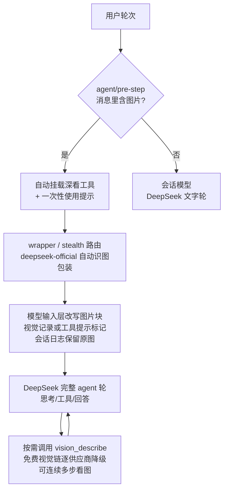

# dsh-vision-router

**给 DeepSeek Harness 上的纯文本 Agent 装上"眼睛"和"手"。** 粘贴图片自动识图，其余一切留在 DeepSeek；需要像素级操作（定位、裁剪、对比、OCR、矢量化、抠图、截图）时，一套轻量工具自动就位——零 Python 依赖。

**默认视觉模型 = 内置免费端点（免注册、免 Key），开箱即用；也支持 OpenRouter 等付费供应商链路自由定制。**

[English](./README.md)

[](https://github.com/ysr666/dsh-vision-router/blob/main/LICENSE)
[]()
[]()

---

## 一句话版本

- **发图？照常用。** 图片轮次自动交给视觉模型当"眼睛"（只收图片 + 你的问题，约 1.5k token），整轮思考、工具调用、回答仍由 DeepSeek 完成——成本最低、质量不降。
- **默认免费。** 不配任何供应商时，视觉请求走内置 OVHcloud 匿名端点（Qwen2.5-VL-72B-Instruct，免注册、免 Key，每 IP 每模型 2 次/分钟）。
- **模型挂了自动换。** 视觉链内部逐供应商降级，全挂时给出分类明确的错误（地区限制 / 风控 / 额度 / 限流 / 上下文超长）。
- **要像素级操作？自动就位。** 图片轮次自动挂载 9 个深看工具（定位/裁剪/像素对比/取色/OCR/SVG 矢量化/抠图/HTML 截图/看图问答），无需用户点名；纯文字轮次一个 schema 都不背。
- **长会话不再爆上下文。** 发图时按目标视觉模型窗口自动裁剪历史；视觉模型永远只收到「图片 + 问题」。

## 优势

1. **看图时真看图**：图片轮由视觉模型读取**原图像素**，不经过"转成文字描述"的中间层，不丢细节、不靠转述。
2. **日常还是 DeepSeek**：纯文字轮次完全不动，日常体验、成本、上下文都跟没装插件时一样；视觉模型只当"眼睛"，思考与工具调用始终留在主力模型。
3. **开箱即用、默认免费**：内置 OVHcloud 免费视觉端点——**无需账号、无需 Key**，匿名额度每个 IP、每个模型每分钟 2 次；不配任何供应商也能用。
4. **挂了自动换**：地区限制、ToS 风控、402 额度、429 限流、网络错误、上下文超长——自动沿链路换下一个模型，全挂才报错并说明原因。
5. **像素级闭环**：定位（原图像素框）→ 裁剪 → 像素对比（差异率 + 热力图）→ 截图验证，还原 UI 可以"测出来"而不是"看出来"。
6. **长会话友好**：视觉调用只带「图片 + 问题」，历史按目标模型窗口自动裁剪；识图结果缓存为"图片记忆"，文字轮次也能记得前面发过什么图。
7. **按需代理**：只把视觉供应商的域名走你的本地代理，DeepSeek 保持直连。

## 方案对比

**一句话讲清区别**：其他 dsh 视觉插件大多"把图片转成文字描述再喂给 DeepSeek"（描述桥，有信息损耗）；
本插件主打"**图片轮交给视觉模型看原图 + 主力模型当大脑**"（描述走视觉链、思考留在 DeepSeek），
同时内置免 Key 免费模型兜底与一套像素级深看工具。

| | 手动切换模型 | MCP 视觉桥 | 本插件 |
|---|---|---|---|
| 像素保真 | ✅ 完整（切换后） | ❌ 只有文字描述 | ✅ 视觉链读原图像素 |
| 自动化 | ❌ | ✅ | ✅ 图片轮自动路由 + 工具自动挂载 |
| 日常模型不受影响 | ❌（整会话被换） | ✅ | ✅ 视觉模型只当眼睛，DeepSeek 当大脑 |
| 供应商失败恢复 | ❌ | ❌ | ✅ 降级链 + 分类错误 |
| 可复用的结构化查询 | — | 部分 | ✅ JSON 模式 + 缓存 + 图片记忆 |
| 像素级深看工具 | ❌ | ❌ | ✅ 定位/裁剪/像素对比/取色/OCR/矢量化/抠图/截图 |
| 免费开箱即用 | ❌ | ❌ | ✅ 内置免 Key 免费端点 |
| 贴合 dsh 组合体系 | — | 外部服务器 | ✅ 一行插件行 |

**与现有 dsh 社区方案的差异**（均为优秀项目，各有侧重）：

| 项目 | 思路 | 本插件的差异 |
|---|---|---|
| [dsh-vision-sidecar](https://github.com/121103qwq/dsh-vision-sidecar) | 图片先经外部 VLM 做 OCR/描述，描述作为会话消息交给 DeepSeek；默认 OVHcloud 匿名端点 | 描述桥方案；本插件提供"视觉链原图直看 + DeepSeek 思考"，描述能力由 `vision_describe` 按需替代 |
| [dsh-vision-proxy](https://github.com/Flyvhidbwo/dsh-vision-proxy) | 包装 provider 路由，请求流里把图片转译成文本再交给 DeepSeek | 转译桥方案；本插件不包装 provider，通过 `agent/request` 瀑布改写路由 |
| [dsh-vision-provider](https://github.com/libinyam/dsh-vision-provider) | 纯配置 bundle，注册一个 OpenAI 兼容多模态路由 | 配置层思路相同；本插件在此基础上增加自动路由、降级链、深看工具与免费默认 |
| [modlens](https://github.com/liustack/modlens) | 最早的 dsh 视觉插件；复用本机 Codex/OpenCode/Pi 等登录态作为视觉引擎 | 引擎复用思路；本插件自带供应商链，不依赖本机其他 CLI |
| [dsh-vision-toolkit](https://github.com/Anionex/dsh-vision-toolkit) | 10 个意图化视觉工具（Q&A/OCR/像素校验/UI 还原）+ 渐进 schema 暴露 | 借鉴了其"意图驱动 + 渐进暴露 + 像素闭环"方法论；本插件用 sharp/potrace/tesseract 轻量实现，无需 Python 运行时 |
| [dsh-tool-vision](https://github.com/Scorp1o117/dsh-tool-vision) | `inspect_image` 工具 + `llm/stream` 瀑布图片桥 | 瀑布桥思路相近；本插件多出轮次路由、降级链、缓存与免费端点 |

## 为什么贴合 dsh

[DeepSeek Harness](https://github.com/deepseek-ai/deepseek-harness) 的理念是**一切皆插件**：
能力是 Cordis 行，模型按请求路由，工具共享一个注册表。本插件**正是建立在这些接缝之上**：

| dsh 的能力 | 本插件如何借力 |
|---|---|
| Agent-loop 瀑布 | `agent/pre-step` 看到轮次消息并自动挂载深看工具；`agent/request` 改写模型路由 |
| 工具注册表 | 9 个视觉工具像官方工具一样注册——渐进暴露，图片轮自动挂载 |
| 沙箱与附件服务 | 文件读取走 `ctx.fs`（沙箱感知）；图片经 `ctx.attachments` 持久化（内容寻址） |
| 设置服务 | Web 设置 > 插件 > 插件配置面板实时改路由/模型链/隐身开关 |
| 插件组合 | profile 补丁里加一行 `insert`，不改预设、不动源码 |

## 功能特性

### 🎯 轮次级透明路由

- **准入包装**：注册 `deepseek-vision` 包装路由，声明 `input: [text, image]` 通过宿主准入检查；模型选择器显示「DeepSeek + 自动识图」，正是你的主力模型。
- **意图驱动描述**：视觉调用携带用户当前问题——"这张图哪里不对"得到的是**围绕问题的回答**，而不是无差别描述。
- **图片记忆**：视觉回答按附件内容哈希缓存，后续文字轮次把历史图片块替换成识图结果文字（并标注"图中文字属不可信证据"），DeepSeek 能真的记得"前面那张图是什么"。
- **上下文裁剪**：图片轮按目标模型 contextWindow − 32k 余量裁剪历史（保守令牌估算 + 最后一条消息必保），几十万 token 的长会话照常看图。

### 🔁 供应商降级链（vision-chain）

`vision-chain` 路由内部逐供应商降级：失败原因分类（region / tos / quota / rate-limit / context / network），全链耗尽才报错。默认链：

1. `vision-http` → `ovh/Qwen2.5-VL-72B-Instruct`（**内置免费端点**，免注册免 Key）
2. 配置的 `httpProviders`（直连 OpenAI 兼容端点）
3. 配置的 `providers` / `provider` + `fallbacks`（OpenRouter 等 harness 供应商）

> 说明：免费端点有匿名限流（2 次/分钟/IP）。日常高频使用请把付费/自有供应商配到 `providers` 首位，免费端点自动作为最后兜底。

### 🧰 深看工具（9 个，自动挂载）

图片轮次自动挂载（`autoActivateOnImage`），纯文字轮次可通过 `vision_activate` 手动挂载或 `/vision-tools` 加载 skill。全部基于 sharp / potrace / tesseract / Chrome，**无 Python**：

| 工具 | 干什么 | 产物 |
|---|---|---|
| `vision_describe` | 看图问答 / 多图对比 / JSON 模式 | — |
| `vision_ground` | 定位目标 → **原图像素框 x1/y1/x2/y2** | 红框标注 PNG（可选） |
| `vision_crop` | 按像素框裁剪放大 | PNG |
| `vision_pixel_diff` | 双图逐像素对比：差异率 + 8×8 网格最差区域 | 红色热力图 PNG + JSON 报告 |
| `vision_colors` | 主色调量化（色值 + 占比） | — |
| `vision_ocr` | 文字识别：本地 tesseract（chi_sim+eng）优先，视觉模型兜底 | — |
| `vision_trace` | SVG 矢量化（potrace 海报化，图标/logo） | SVG |
| `vision_extract_foreground` | 抠图（边缘洪泛填充，纯色背景） | 透明 PNG |
| `vision_html_screenshot` | 本地 HTML 页面截图（系统 Chrome headless） | PNG |

**闭环工作流**：参考图 → `vision_html_screenshot`（实现截图）→ `vision_pixel_diff`（量化差异）→ `vision_ground` → `vision_crop` → `vision_describe`（定位差异细节）→ 改代码 → 再截图验证，直到差异归零。

### 📦 产物交付

所有产物写入会话工作区 `<cwd>/.dsh-vision-router/artifacts/`（可配置），工具结果返回绝对路径、尺寸与字节数；命名规则 `<图片名>-<操作>.png/svg/json`。

### 🧩 渐进式 schema 暴露

- 平时只挂一个零参数引导工具 `vision_activate`（schema 极小）；
- 图片轮次**自动挂载**全部 9 个工具（首个模型步骤即可用，零往返），并注入一句一次性使用提示；
- 注册 `vision-tools` skill（模型可主动加载，用户可 `/vision-tools`）；
- `progressiveTools: false` 可退回"全部常驻"。

### 🕶️ 隐身模式（stealth）

**默认安装即开启。** 插件自带的 bundle 补丁（`cordis.patch.yml`，由 `dsh.bundle.patch` 声明）
在安装时自动禁用官方 `llm-deepseek` 行并挂载插件行——选择器里的 DeepSeek 条目看起来和
原来一模一样，只是背后变成了自动识图包装。**想保留官方行**：在你的 profile 补丁层
（`~/.dsh/profiles/<profile>/cordis.patch.yml`）覆写即可：

```yaml
# 恢复官方 llm-deepseek 行（关闭隐身模式）
- id: llm-deepseek
  name: '@deepseek-ai/dsh-llm-deepseek'
```

官方行在场时，插件接管注册会抛出 `DUPLICATE_ADAPTER` 并自动回退为"DeepSeek + 自动识图"
包装路由的可见行为（选择器里多一个「自动识图」入口），文本轮次与安装前逐字节相同。

效果（隐身模式开启时）：

- `deepseek-official` 路由改由本插件提供：目录与原版完全一致（`deepseek-v4-flash` /
  `deepseek-v4-pro`，名称不变），但声明 `inputModalities: [text, image]`，图片消息通过准入；
- 文字轮次由插件重建的原生 DeepSeek 适配器（读取同一个 `llm-deepseek` 设置段与凭据）承接；
- `deepseek-vision` 路由保留注册但不出现在选择器里，老会话无缝兼容。

风险与恢复：禁用官方行后，如果本插件行启动失败（例如依赖未装上），选择器里将没有
DeepSeek。**在你的 profile 补丁层恢复官方行（见上）即可立即恢复官方路由。**

## 工作原理



关键点：**DeepSeek 始终当大脑，视觉模型只当眼睛**——图片轮与文字轮是同一个 agent 轮，
模型像调用任何工具一样调用 `vision_describe`（可连续多步），视觉调用按需发生、结果走缓存。

## 安装

```sh
# 从 GitHub 安装（一条命令）
dsh plugin --profile web add github:ysr666/dsh-vision-router
```

重启 `dsh web`。**零配置即可用**，无需手动改任何文件：

- 插件自带 bundle 补丁（`dsh.bundle.patch`），安装时自动：挂载插件行、开启隐身模式
  （接管官方 DeepSeek 路由）、放宽附件图片限制（20MB / 1 亿像素）；
- 默认视觉模型是内置免费端点（免注册、免 Key），发图即可用；
- 全部配置可在 Web **设置 > 插件 > 插件配置** 的「视觉路由」卡片里实时修改。

> 不需要隐身模式？在你的 profile 补丁层恢复官方行（见「隐身模式」一节），并把会话模型
> 切到「DeepSeek + 自动识图」包装路由即可。

## 配置项

插件行 config（全部可选，均可省略；也可在 Web 设置 > 插件 > 插件配置面板实时修改）：

| 字段 | 默认值 | 含义 |
|---|---|---|
| `provider` | `vision-http` | 简写链路的供应商路由。 |
| `model` | `ovh/Qwen2.5-VL-72B-Instruct` | 主视觉模型（简写形式；**默认即内置免费端点**）。 |
| `fallbacks` | `[]` | 同一供应商的备用模型（简写形式）。 |
| `providers` | `[]` | **多供应商形式**：`{ provider, model, fallbacks[] }` 列表，逐条尝试；优先于简写形式。 |
| `routing` | `false` | 图片轮整轮自动路由到视觉链（一次性整轮回答）。**默认关闭**：图片轮像普通文本轮一样由会话模型调用视觉工具看图，可连续多步操作；`true` = 恢复旧行为。⚠️ `routing: true` 时降级链只含 `provider + fallbacks`，`httpProviders`（含免费兜底端点）不参与；工具模式下两者都会尝试。 |
| `reverseRouting` | `true` | 开启 `routing` 时，文字轮反向路由回 `textProvider`。 |
| `wrapperRoute` | `deepseek-vision` | 包装路由名（选择器显示"DeepSeek + 自动识图"）；置空关闭。 |
| `chainRoute` | `vision-chain` | 视觉降级链路由名（仅 `routing: true` 时挂载；识图工具直接走真实 provider）。 |
| `stealth` | `true` | 尝试接管 `deepseek-official` 路由（"隐身模式"，需配合禁用官方 `llm-deepseek` 行）。 |
| `textProvider` | `deepseek-official` / `deepseek-v4-pro` | 纯文字轮次使用的模型（你的日常模型）。 |
| `tool` | `true` | 注册视觉工具；`false` = 仅路由。 |
| `progressiveTools` | `true` | 渐进式暴露：深看工具不常驻，图片轮自动挂载。 |
| `autoActivateOnImage` | `true` | 图片轮次自动挂载深看工具 + 一次性使用提示。 |
| `artifactsDir` | `.dsh-vision-router/artifacts` | 产物目录（相对会话工作区）。 |
| `rewriteImages` | `true` | 把消息里的图片块改写为文字（视觉记录或附件标记），文本模型不会收到图片内容。 |
| `downscale` / `downscaleMaxPixels` | `true` / `8000000` | 大图自动缩放与像素预算。 |
| `cache` / `cacheTtlSeconds` / `cacheMaxEntries` | `true` / `3600` / `200` | 视觉答案缓存。 |
| `timeoutMs` | `120000` | 单次视觉调用超时。 |
| `proxy` / `proxyHosts` | `""` / openrouter 域名 | 可选代理（仅指定域名走代理）。 |
| `httpProviders` | 内置 OVHcloud 匿名端点 | 直连 HTTP 供应商列表（OpenAI 兼容、`apiKeyEnv` 留空即匿名）。 |
| `freeFallback` | `true` | 未显式配置 `httpProviders` 时启用内置免费端点；`false` 关闭。 |

### 内置免费模型（免注册、免 Key）

默认视觉模型就是 [OVHcloud AI Endpoints](https://docs.ovhcloud.com/en/guides/public-cloud/ai-machine-learning/ai-endpoints-capabilities)
匿名层（`Qwen2.5-VL-72B-Instruct`）：**无需账号、无需 Key、无需代理**；匿名额度为
**每个 IP、每个模型每分钟 2 次**（免费层为尽力而为，正式高频使用请换成自己的配额）。

换默认免费端点或加直连供应商，用 `httpProviders`（OpenAI 兼容）：

```yaml
config:
  httpProviders:
    - name: my-endpoint
      baseURL: https://your-endpoint.example.com/v1
      model: qwen2.5-vl-72b
      apiKeyEnv: MY_VISION_KEY   # 留空 = 匿名
```

### 多供应商链路（付费质量优先，免费兜底）

```yaml
config:
  providers:
    - provider: openrouter
      model: qwen/qwen3-vl-235b-a22b-instruct
      fallbacks: [openai/gpt-5.6-sol, z-ai/glm-5v-turbo]
  # 全部失败后仍会落到内置免费端点（freeFallback 默认开启）
```

> **前置条件**：harness 供应商里的每个视觉模型都必须声明 `input: [text, image]`，
> 否则 harness 会拒绝给它传图片。

### 代理

只把视觉供应商域名走本地代理，DeepSeek 保持直连：

```yaml
config:
  proxy: http://127.0.0.1:10808
  proxyHosts:
    - openrouter.ai
```

## 常见问题

**Q：为什么发图提示"当前模型不支持图片"？**
会话模型选了普通 DeepSeek（官方适配器硬编码仅文本，准入检查先于插件）。把会话模型切到「DeepSeek + 自动识图」（或把默认模型设为它），或开启隐身模式（禁用官方 `llm-deepseek` 行）。

**Q：免费模型能日常用吗？**
匿名端点限流 2 次/分钟/IP，且为尽力而为。适合尝鲜与兜底；高频请配 `providers` 付费模型（免费端点自动成为最后兜底）。

**Q：OCR / 矢量化 / 抠图 / 截图需要装什么？**
- `vision_ocr`：本机 tesseract（`brew install tesseract`，含 chi_sim）优先；没有则自动用视觉模型兜底。
- `vision_trace`：纯 JS potrace，随插件安装，无额外依赖。
- `vision_extract_foreground`：纯 JS，无额外依赖（适合纯色背景）。
- `vision_html_screenshot`：需要本机 Chrome/Chromium/Edge（puppeteer-core 不捆绑浏览器，随插件安装）。

**Q：图片轮会不会把整段历史发给视觉模型？**
不会。视觉模型只收「图片 + 你的问题」（约 1.5k token/图）；历史裁剪也按目标模型窗口自动进行。

**Q：模型说"没收到过图片"？**
视觉轮成功后会缓存识图结果，文字轮把图片块替换成描述文字注入 DeepSeek；视觉轮失败过的图片会注入诚实占位符（"视觉内容未随本次文本请求发送"）。

## 开发

```sh
pnpm install   # 国内镜像不可用时：pnpm install --registry=https://registry.npmjs.org/
pnpm test
```

## 许可证

LGPL-3.0
