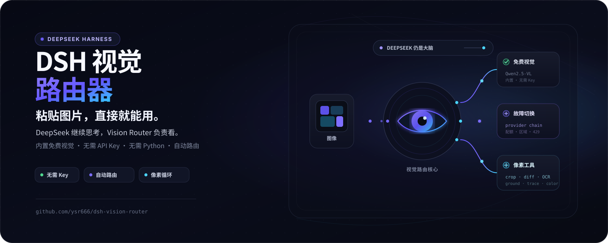
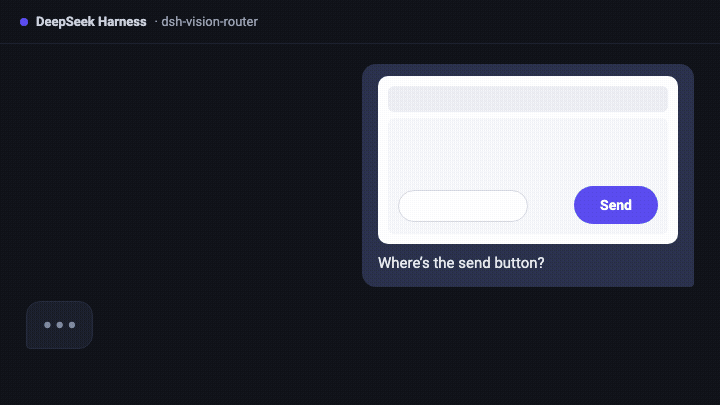
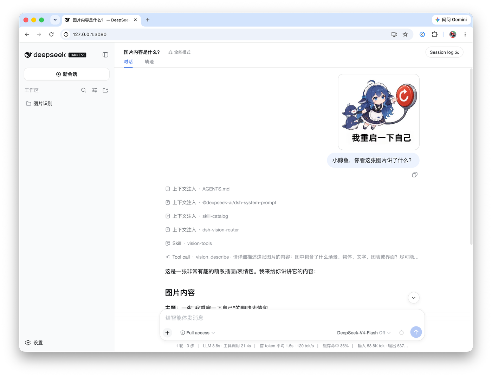
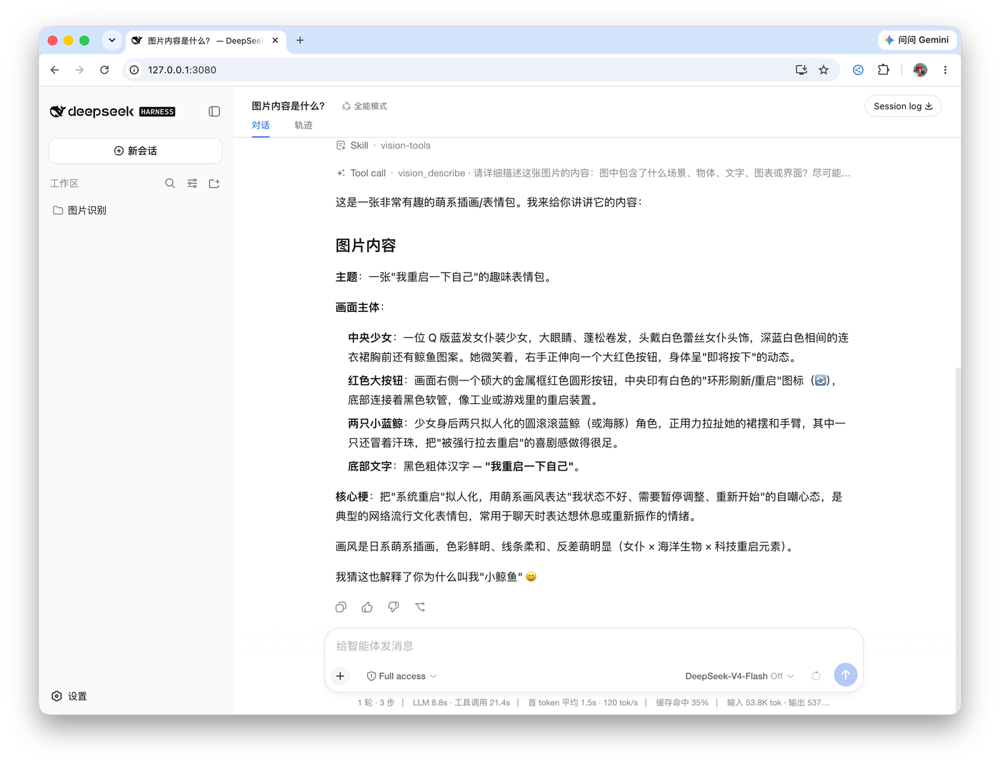
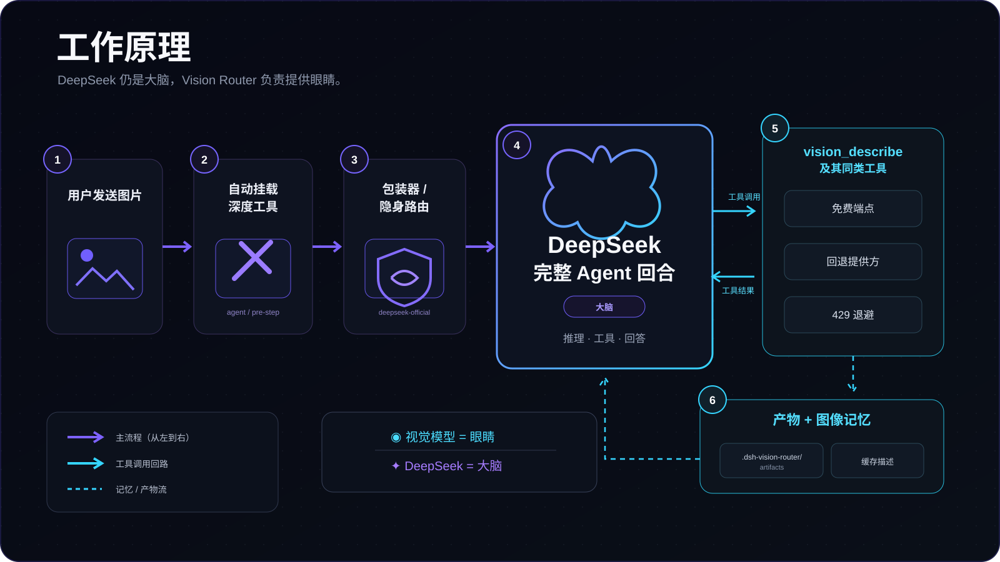
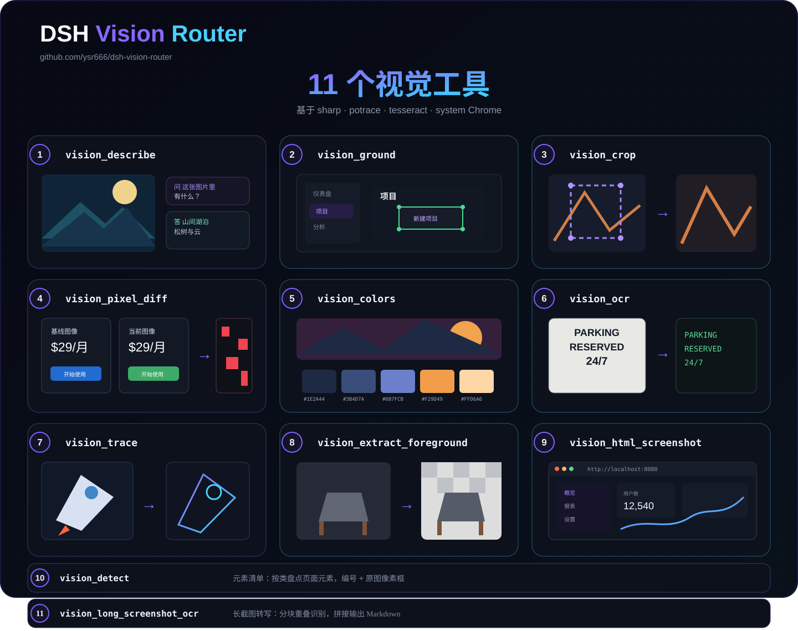
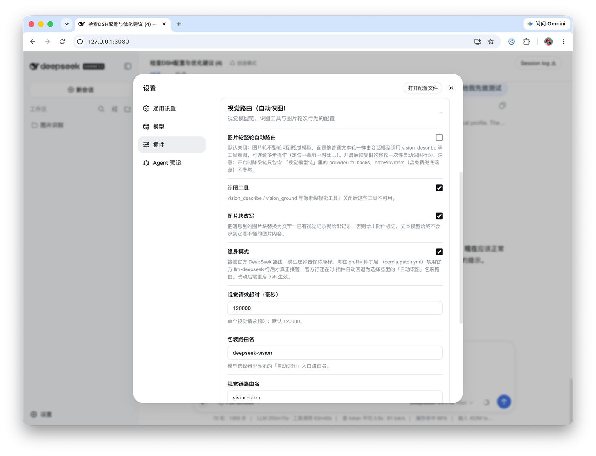

<p align="center">
  
</p>

<h1 align="center">dsh-vision-router</h1>

<p align="center"><strong>一键开启识图：给 DeepSeek Harness 的纯文本 Agent 装上“眼睛”——开箱免费、免 Key、无 Python、一条命令安装。</strong></p>

<p align="center">DeepSeek 只负责思考，内置免费视觉链 + 14 个深看工具负责“看”；需要看图时开启输入框旁的「👁 识图」，图片轮次就像普通工具调用一样自然、可定位、可验证。</p>

<p align="center">
  <a href="https://awesome-dsh-plugin.com"></a>
  <a href="https://github.com/zp-home/dsh-recommend"></a>
  <a href="https://www.dshbase.com/plugins/dsh-vision-router/"></a>
  <a href="https://github.com/SoberReport-AI/DeepGuard/blob/main/reports/dsh-vision-router/2.0.1/39c8f2b2d69aa398418fd6c8ab40b691a92a1a3d.json"></a>
  <a href="https://whyihaveyou.github.io/dsh-suite/"></a>
</p>

<p align="center">
  <a href="https://github.com/ysr666/dsh-vision-router/releases/tag/v2.1.0"></a>
  <a href="tests"></a>
  <a href="LICENSE"></a>
  <a href="package.json">=22" /></a>
  
</p>

<p align="center">
  <sub>生态收录：</sub>
  <a href="https://dshplugin.app/plugins/dsh-vision-router">DSHPlugin.app</a> ·
  <a href="https://github.com/diegosouzapw/awesome-omni-dsh-plugins">Awesome Omni DSH Plugins</a> ·
  <a href="https://dshpluginhub.ai/plugins/dsh-vision-router">dshpluginhub.ai</a> ·
  <a href="https://www.dsh.plus/zh/plugins/dsh-vision-router/">dsh.plus</a> ·
  <a href="https://dshplugins.ai/">dshplugins.ai</a> ·
  <a href="https://dshmarket.com/p/ysr666/dsh-vision-router/">dsh-market</a>
</p>

<p align="center"><a href="README.md">English</a> · 中文</p>

<p align="center">💬 <strong>QQ 用户交流群：1105463028</strong></p>

> [!WARNING]
> 📌 **公告（v2.1.0）**
>
> **v2.1.0：原生五卡设置、输入框识图、运行时双语、能力路由/测评加固，并正式启用 DSH rc.8 最低支持线。** [查看完整更新 →](docs/releases/v2.1.0.md)

<p align="center">
  
</p>

## 目录

- [为什么做这个](#为什么做这个)
- [对比同类插件](#对比同类插件)
- [设计来源](#设计来源)
- [致谢](#致谢)
- [快速开始](#快速开始)
- [免费视觉 Key 渠道](#免费视觉-key-渠道)
- [亮点](#亮点)
- [工作原理](#工作原理)
- [工具](#工具)
- [配置项](#配置项)
- [安装与生命周期](#安装与生命周期)
- [故障排查](#故障排查)

## 为什么做这个

大多数 DSH 视觉插件把图片“翻译”成一段文字描述再喂给 DeepSeek——有损、一次性、看不见像素。本插件把**Host 规范化后的图像像素留在视觉模型侧**、把推理留在 DeepSeek 侧，并把“看图”变成一次**普通的工具调用**：

- **一条命令安装。** 包自带组合补丁（`dsh.bundle.patch`）：`dsh plugin add` 自动完成插件行挂载、准入包装与附件限制放宽——不用手改任何文件。是否接管官方 DeepSeek 路由由「隐身模式」开关决定（默认关）。
- **默认免费。** 视觉工具最终兜底为 5 个 OVHcloud 匿名视觉模型：免注册、免 Key，每 IP、每模型 2 次/分钟，独立限额理论合计约 10 次/分钟；用户自备视觉模型会优先调用。
- **无 Python。** 整条管线——缩放、定位、裁剪、像素对比、取色、OCR、SVG 矢量化、抠图、HTML 截图——全部基于 sharp / potrace / tesseract / 系统 Chrome。
- **可连续多步看图。** 图片轮 = 调用工具的文本轮：`vision_ground` → `vision_crop` → `vision_describe` → `vision_pixel_diff` → 修复 → 再截图，Agent 可以一直迭代到任务完成。
- **DeepSeek 始终是大脑。** 文字轮在模型、成本、上下文上完全不动；视觉模型只当“眼睛”、按需调用，答案按图片内容缓存。
- **界面无感。** 上传的图片在会话界面里照常显示为图片；指向视觉工具的改写只发生在模型输入层，从不写入会话日志。

## 对比同类插件

**一句话讲清区别**：其他 dsh 视觉插件大多"把图片转成文字描述再喂给 DeepSeek"（描述桥，有信息损耗）；
本插件主打"**图片轮直接交给视觉模型看图像像素**"（路由桥，像素级），同时内置免 Key 免费模型兜底。

> [!NOTE]
> 在 DSH 0.1.2-alpha.1+ 上，附件仍由 Host 单一持有。Vision Router 消费的是 Host 持久化后的 canonical image：落在规范化限制内的单帧 8-bit sRGB/sRGBA 图片可以逐字节直通；需要旋转、色彩空间、元数据、动画或尺寸规范化的图片可能会被重新编码。因此像素工具承诺的是 Host canonical raster，而不是上传源文件编码字节逐字节不变。

| | 手动切换模型 | MCP 视觉桥 | 本插件 |
|---|---|---|---|
| 图像像素 | ✅ 可用（切换后） | ❌ 只有文字描述 | ✅ Host 规范化栅格，图片轮内 |
| 自动化 | ❌ | ✅ | ✅ |
| 日常模型不受影响 | ❌（整会话被换） | ✅ | ✅ |
| 供应商失败恢复 | ❌ | ❌ | ✅ 降级链 |
| 可复用的结构化查询 | — | 部分 | ✅ JSON 模式 + 缓存 |
| 免费开箱即用 | ❌ | ❌ | ✅ 内置免 Key 免费端点 |
| 贴合 dsh 组合体系 | — | 外部服务器 | ✅ 一行插件行 |

**与现有 dsh 社区方案的差异**（均为优秀项目，各有侧重；描述以各家 README 2026-08 状态为准）：

| 项目 | 思路 | 本插件的差异 |
|---|---|---|
| [dsh-vision-sidecar](https://github.com/121103qwq/dsh-vision-sidecar) | 图片先经外部 VLM 做 OCR/描述，描述作为会话消息交给 DeepSeek；默认 LLM7.io 匿名端点（OVHcloud 为无 Key 备选） | 描述桥方案；本插件提供"图像直看"路由，描述能力由 `vision_describe` 按需替代 |
| [dsh-vision-proxy](https://github.com/Flyvhidbwo/dsh-vision-proxy) | 包装 provider 路由，请求流里把图片转译成文本再交给 DeepSeek | 转译桥方案；本插件不包装 provider，通过 `agent/request` 瀑布改写路由 |
| [dsh-vision-provider](https://github.com/libinyam/dsh-vision-provider) | 注册 `DeepSeek + Vision` 组合路由：图片先经所选视觉模型转成描述，再交给 DeepSeek | 双模型桥思路；本插件在此基础上增加自动路由、降级链与工具 |
| [modlens](https://github.com/liustack/modlens) | 最早的 dsh 视觉插件；复用本机 Claude Code/Codex/OpenCode/Pi 等登录态作为视觉引擎 | 引擎复用思路；本插件自带供应商链，不依赖本机其他 CLI |
| [dsh-vision-toolkit](https://github.com/Anionex/dsh-vision-toolkit) | 10 个意图化视觉工具（Q&A/OCR/像素校验/UI 还原），按需显式调用 | 工具集更全；本插件多出整轮自动路由与免 Key 免费兜底 |
| [dsh-tool-vision](https://github.com/Scorp1o117/dsh-tool-vision) | `inspect_image` 工具 + `agent/pre-step` 瀑布图片桥（粘贴图入日志前转成工具提示） | 瀑布桥思路相近；本插件多出轮次路由、降级链、缓存与免费端点 |

## 设计来源

本项目的深度视觉工具层与 UI restoration 工作流参考并受到 [Anionex/agent-vision-toolkit](https://github.com/Anionex/agent-vision-toolkit) 及其 DSH 原生实现 [Anionex/dsh-vision-toolkit](https://github.com/Anionex/dsh-vision-toolkit) 的设计影响。具体包括意图驱动的工具选择、渐进式工具暴露、pixel-diff 验证闭环，以及部分视觉工具的职责划分与命名，包括长截图 OCR、前景提取和 HTML screenshot 等设计。

`dsh-vision-router` 中相关代码均为独立实现。在这些设计参考基础上，本项目独立发展了 turn-level/tools-first vision routing、DSH 准入/包装集成、多视觉后端与故障 fallback chain、内置免费视觉模型链、附件/图片记忆、缓存与相关运行时容错机制。

感谢 Anionex 的先行工作以及整个 DSH 社区的探索。清晰的设计归因与独立迭代并不冲突；二者都有助于维护开放、协作、健康的 DSH 生态。

## 致谢

本插件借鉴了以上全部社区项目的思路，特别是 [dsh-vision-sidecar](https://github.com/121103qwq/dsh-vision-sidecar)
对免注册免 Key 视觉端点的探索（LLM7.io 与 OVHcloud 匿名层）。感谢
[dsh-vision-proxy](https://github.com/Flyvhidbwo/dsh-vision-proxy)、
[dsh-vision-provider](https://github.com/libinyam/dsh-vision-provider)、
[modlens](https://github.com/liustack/modlens)、
[dsh-vision-toolkit](https://github.com/Anionex/dsh-vision-toolkit)、
[dsh-tool-vision](https://github.com/Scorp1o117/dsh-tool-vision) 作者们的探索。

## 快速开始

### 1. 安装插件

普通 npm / npx 安装只需要一条命令：

```sh
npx @deepseek-ai/dsh plugin --profile web add dsh-vision-router
```

> [!WARNING]
> 如果这个 profile 里已经有通过 `cordis.patch.yml` **手动挂载**的社区插件，不要再把这种旧式加载方式与 `dsh plugin add` / `dsh plugin list` 混用：当前 DSH CLI 可能同时把带 bundle patch 的依赖追加到 `dsh.profile.bundles`，导致这些插件被重复注册。请先把原有手动插件迁移到 bundle 管理方式，或继续沿用手动安装路径。详见 [deepseek-harness Discussion #2889](https://github.com/deepseek-ai/deepseek-harness/discussions/2889)。

> [!NOTE]
> 第三方 `dsh-web-plugin-manager` / `dshpm` **v0.4.2+** 现已兼容：其质量门已正确放行作为运行时依赖的 `@deepseek-ai/schemastery`。上面的官方 DSH CLI 仍是推荐安装方式。

如果你是从 DeepSeek Harness 源码仓库通过 pnpm 运行，`dsh` 不一定在系统 `PATH` 里，请改用工作区脚本：

```sh
cd deepseek-harness
pnpm dsh plugin --profile web add dsh-vision-router
```

如果你已经全局安装 DSH CLI，并且终端里能直接执行 `dsh`，也可以继续使用较短的 `dsh ...` 写法。安装完成后，按你平时的方式启动或重新加载 DSH Web 即可。

> [!NOTE]
> 如果你是把插件**首次安装进一个已经长期运行的 Web 进程**，需要让 DSH Web 进程重新加载一次插件本体。插件加载完成后，新增/删除模型、修改自动识图包装范围都会**热更新，无需再重启 DSH**。

### 2. 选择日常模型，按需开启「👁 识图」

聊天页右下角的原生模型选择器只负责选择你的**脑子/会话模型**，例如 DeepSeek、Qwen 或其他普通模型。Vision Router 生成的内部「+ 自动识图」wrapper 默认不会出现在原生模型列表和 `/model` 中。

需要看图时，在输入框旁主动点击 **「👁 识图」**：

- `👁 识图`：当前普通模型，识图关闭；
- `👁 识图 ✓`：已切到该模型对应的 Vision Router 内部识图 route；
- 开启后会持续生效，发送消息后**不会自动复位**；
- 主动关闭会切回同一个普通模型；手动选择另一个普通模型会关闭识图；
- 只修改当前模型的 reasoning effort 不会关闭识图。

> [!IMPORTANT]
> **上传 / 粘贴图片不会替你自动开启识图。发图前请先确认按钮处于 `👁 识图 ✓`。**
>
> Vision Router 仍保留真实 wrapper route 来通过 DSH 的图片准入，只是把它们作为内部实现隐藏起来。若浏览器端无法安全确认某个 route 属于 Vision Router，隐藏逻辑会 fail-open：宁可显示该 route，也不会误藏第三方模型。

### 3. 粘贴或上传图片

开启「👁 识图」后，直接往对话里贴图即可。默认情况下完整视觉工具表从会话开始就保持稳定，Agent 可直接调用 `vision_describe`、`vision_ground`、`vision_crop` 等工具看图，需要时连续多步操作。

如果当前 session 已经包含图片，DSH 可能拒绝从识图 route 切回不接受图片的纯文本 route。此时 Vision Router 不绕过 Host 约束：会显示与原生模型选择器一致的临时错误提示，真实模型保持不变，`👁 识图 ✓` 也继续反映真实状态，可继续使用或稍后重试。

默认已经有内置 OVH 匿名视觉兜底，无需注册、无需 Key。**聊天页右下角只选择“脑子/会话模型”**；视觉模型不要在那里选。高级配置在 **设置 → Vision Router**：视觉后端链每一行都可以选择 **设置 → 模型** 中任意可调用的生成式用户模型。DSH 的图片能力声明现在只作提示：未声明图片能力、甚至被标成仅文本的模型也会列出并给出警告。运行时永远先通过该供应商已注册的 DSH adapter 实际调用，因此 WebSocket、RPC 和私有协议都保留原生传输；只有明确识别为 http(s) OpenAI Chat Completions 的渠道才可能进入 HTTP 直连兼容兜底。实际调用失败后自动尝试下一后端；一行都不填也可以，OVH 免费链会固定在最后兜底。插件内部的 `Vision HTTP` 只是传输实现，不是用户需要选择的模型组。

### 实际效果

*左：一次图片轮——用户发图，Agent 通过免费链路调用 `vision_describe` 并作答。右：最终的结构化解读。*

<p align="center">
  
  
</p>

## 免费视觉 Key 渠道

内置 OVH 兜底是匿名设计，OVH 对匿名访问的限制是**每 IP、每模型 2 次/分钟**。觉得不够用时，下面这些渠道都有**免费且额度大得多的视觉模型**——全部免费注册，无需为免费档付费。免费政策轮换频繁，下表是 2026 年 8 月快照，依赖前请以各家控制台为准。

| 渠道 | 免费视觉模型 | 免费额度 | 大陆直连 | Key 领取 |
|---|---|---|---|---|
| OVHcloud AI Endpoints（access key） | `Qwen2.5-VL-72B-Instruct`——与内置兜底同一个端点 | **400 次/分钟**/项目/模型（对比匿名 2 次/分钟） | ✅ | 注册 OVH 账号 → Public Cloud 项目（需挂支付方式；免费模型不扣费）→ AI Endpoints access key |
| 智谱（bigmodel.cn） | `glm-4.6v-flash` · `glm-4.1v-thinking-flash` · `glm-4v-flash`——三个永久免费模型，串起来容量 ×3 | token 不限量 | ✅ | open.bigmodel.cn → API keys |
| 阿里云百炼 | `qwen3-vl-flash`（限免）与 Qwen-VL 系列 | 新用户每模型系列 100 万 token / 90 天 | ✅ | bailian.console.aliyun.com |
| Intern AI（上海AI实验室） | `internvl-latest` · `internvl3.5-latest` | 30 RPM，**9000 万 token/月** | ✅ | chat.intern-ai.org.cn |
| Groq | `meta-llama/llama-4-scout-17b-16e-instruct`（原生多模态，最多 5 张图） | 30 RPM / 14,400 次/天，免卡 | ❌ 需代理 | console.groq.com |
| Google AI Studio | `gemini-2.5-flash` · `gemini-2.5-flash-lite` | 10–30 RPM / 500–1,500 次/天 | ❌ 需代理 | aistudio.google.com |
| NVIDIA NIM | `meta/llama-3.2-11b-vision-instruct` · `nvidia/nemotron-nano-12b-v2-vl` | 40 RPM，免卡 | ⚠️ | build.nvidia.com |
| OpenCode Zen | `mimo-v2.5-free`（视觉 + 代码） | 30 RPM / 500 次/天 | ⚠️ | opencode.ai/zen |
| OpenRouter | `google/gemma-4-26b-a4b-it:free` · `google/gemma-4-31b-it:free` | 未充值账户 50 次/天 | ❌ 需代理 | openrouter.ai |

以上渠道都能以 `httpProviders` 条目加入视觉链（Key 放对应环境变量或 `~/.dsh/.credentials.yaml`），链路会先尝试你的条目、再落到匿名兜底。

> [!NOTE]
> 免费政策随时可能调整——Cerebras 已在 2026 年 7 月取消免费档（改为一次性 $5 赠金），SambaNova 免费档收紧到 20 次/天，Hugging Face 只剩 $0.10/月。第三方“`:free` 中转”聚合站刻意不列入：轮换频繁、无 SLA，部分还存在违反上游条款的转售行为。

## 亮点

- **能力感知 Auto 路由。** 想要确定性就继续按配置顺序；想自动选择时再显式开启 Auto，只在已配置模型和已有实测证据上调整优先级。不会通过模型名猜能力，单纯开启 Auto 也不会自动发起测评。
- **可验证的模型测评。** 「测试识图」只向当前精确模型发一次请求；Quick / Full 分别测 OCR、通用理解，以及结构化、文档、定位等能力。后台能力数据是独立授权，并会给真实前台识图让路。
- **原图像素，真实答案。** 视觉链按原始分辨率读图（仅为保护延迟/额度自动缩放）；你的问题随图一起发送，答案围绕*你的问题*，而不是一段泛泛的描述。
- **自动降级 + 分类报错。** 地区限制、ToS 风控、402 额度、429 限流、上下文超长、网络故障——链路逐供应商尝试，全部失败才报错并给出可操作的建议。遇到 429 会立即尝试下一后端，并按 Retry-After 开启冷却，不会在单次请求内睡眠等待。
- **图片记忆。** 视觉答案按附件内容哈希缓存；后续文字轮用记录的描述替换历史图片（标注为不可信证据），DeepSeek 真正“记得”之前发过的图，且不重复消耗视觉调用。
- **可验证的像素闭环。** 参照图 → `vision_html_screenshot` → `vision_pixel_diff`（差异率 + 红色热力图 + 最差区域排行）→ 修复 → 再对比，直到差异收敛。UI 还原从“目测”变成“实测”。
- **稳定工具 schema。** 默认从会话开始就注册完整 14 个深看工具，避免图片轮中途扩展工具列表导致长上下文的 KV / prefix cache 失效。仍保留 `progressiveTools: true` 作为高级启动期 opt-in；开启后才使用 `vision_activate` 按需挂载。详见 [`docs/progressive-tools-cache.md`](docs/progressive-tools-cache.md)。
- **选择性代理。** 只有配置的视觉供应商域名走本地代理；DeepSeek 保持直连。

### 像素闭环实测

[](assets/pixel-loop-zh.png)

<p align="center"><sub>点击图片可查看完整原图。</sub></p>

Agent 仅根据参考图复刻 UI，再用 `vision_pixel_diff` 验证最终结果：**最终差异 2.54%**（32,939 / 1,296,000 个差异像素，threshold 16/channel）。

## 工作原理

<p align="center">
  
</p>

视觉模型**只当眼睛**，DeepSeek **始终是大脑**。图片轮永远不会被一次性视觉答案“劫持”——Agent 自己驱动工具，可以跨多个步骤持续对同一张图操作。

## 工具

默认 `progressiveTools: false`：14 个深看工具从插件启动时就保持常驻，文本轮和图片轮都可直接调用。若你在 profile / composition 的 `cordis.patch.yml` 中显式开启 `progressiveTools: true`，才会恢复渐进模式：初始只暴露 `vision_activate`，首次需要时再挂载完整工具，并注册 `vision-tools` 技能。该开关是启动期配置，修改后需重启 DSH。全部工具基于 sharp / potrace / tesseract / 系统 Chrome——无 Python：

<p align="center">
  
</p>

图中展示 11 个图像处理工具；另有 `vision_materialize`、负责持久展示图片的 `vision_present` 与可选 1+x 结构化首遍识别的 `vision_bootstrap`，默认深看工具集共 14 个。若启动时显式开启隐私敏感的 `vision_screenshot`，则额外增加为第 15 个工具。

| 工具 | 作用 | 产物 |
|---|---|---|
| `vision_bootstrap` | 可选 1+x 结构化首遍视觉识别；先建立任务无关证据底图，再至少进行 1 次后续视觉调用 | — |
| `vision_describe` | 看图问答 / 多图对比 / 结构化证据 JSON 模式（摘要 + 布局区域 + 实体清单 + 原文转写） | — |
| `vision_materialize` | 把已授权附件复制到会话工作区并返回真实文件路径，供本地 OCR/解析器降级使用；不调用视觉模型或网络 | image copy |
| `vision_ground` | 定位目标 → **原图像素框 x1/y1/x2/y2** | 标注 PNG（可选） |
| `vision_detect` | 盘点某类元素（按钮/输入框/链接…）→ 编号清单 + 原图像素框 | 编号标注 PNG |
| `vision_crop` | 按像素框裁剪放大 | PNG |
| `vision_present` | 把生成或编辑后的本地图片发布为持久聊天附件，供用户查看 | 图片附件 |
| `vision_pixel_diff` | 逐像素对比：差异率 + 最差 8×8 网格区域 | 红色热力图 PNG + JSON 报告 |
| `vision_colors` | 主色提取（十六进制 + 占比） | — |
| `vision_ocr` | 文字转写：本地 tesseract（中英）优先，视觉模型兜底 | — |
| `vision_trace` | SVG 矢量化（potrace 分色；图标/logo） | SVG |
| `vision_extract_foreground` | 边界洪泛抠图（纯色背景） | 透明 PNG |
| `vision_html_screenshot` | 给本地 HTML 文件截图（无头系统 Chrome）；`fullPage: true` 截整页并返回 `pageHeight` | PNG |
| `vision_screenshot` | **默认关闭，必须显式开启隐私开关。** 截取 Windows 虚拟屏幕、macOS 主显示器或 Linux 根窗口；Windows 使用 PowerShell CopyFromScreen，macOS 使用 `screencapture`，Linux 需安装 ImageMagick `import` 或 `scrot`；`identify=true` 可按顺序尝试已启用的本地识别后端并返回路径+识别文本 | PNG / +描述文本 |
| `vision_long_screenshot_ocr` | 长截图转写：重叠分片，tesseract 优先 / 视觉模型回退，按序拼接 Markdown | 分片 PNG + Markdown + manifest |

图片格式按**魔数识别**，无扩展名的内容寻址附件文件也能直接用（不用再复制成 `.png`）。

**常用流程**

```text
vision_ground image="ref.png" target="发送按钮"
vision_detect image="page.png" target="输入框"
vision_crop   image="ref.png" region="1067,841,1108,881"
vision_present path="rebuilt.png"
vision_describe paths=["ref.png","impl.png"] question="列出两图的差异" json=true
vision_pixel_diff original="ref.png" rebuilt="screenshot.png"
vision_ocr image="screenshot.png"
vision_colors image="ref.png" top=8
vision_trace image="icon.png" steps=4
vision_extract_foreground image="logo.png"
vision_html_screenshot source="page.html" width=1200 height=720
vision_html_screenshot source="page.html" width=1200 height=720 fullPage=true
vision_long_screenshot_ocr image="chat-log.png" chunkHeight=1200 overlap=120
```

## 供应商降级链

视觉工具按顺序逐个尝试，全部失败才报错：

1. **用户视觉模型**：设置页里一行一个，从上到下；已启用供应商即使模型枚举部分失败也会保留在下拉中，可调用的生成式模型继续可选，图片能力声明只作提示，最终以运行时实际调用为准；
2. **本地 Ollama（可选，默认关）**：`localOllama.enabled` 开启后，通过本机 Ollama 做免 Key、离线识别（例如 qwen2.5vl）；
3. **本地 LM Studio（可选，默认关）**：`localLmStudio.enabled` 排在 Ollama 之后，模型名必须填写 LM Studio Developer 页或 `/v1/models` 返回的真实标识；
4. **高级自定义 HTTP 视觉端点**：旧配置/高级配置中的 `httpProviders` 排在本地后端之后；
5. **内置 OVH 匿名免费兜底**：固定最后尝试，不需要出现在任何模型选择器里。当前内置链按质量优先为 `Qwen3.5-397B-A17B` → `Qwen2.5-VL-72B-Instruct` → `Qwen3.6-27B` → `Mistral-Small-3.2-24B-Instruct-2506` → `Qwen3.5-9B`。OVH 匿名限额为 **每 IP、每模型 2 次/分钟**；5 个模型是独立限额，因此理论上分散请求可到约 **10 次/分钟**，实际仍以 OVH 当时的限流为准。免注册、免 Key。想提额度？详见[免费视觉 Key 渠道](#免费视觉-key-渠道)——同一个端点挂免费 access key 后是 400 次/分钟。

> [!IMPORTANT]
> 这里的“视觉链”是 Vision Router 调用的**眼睛**：设置页里每一行只选一个用户视觉模型；聊天页右下角选择的是**脑子/会话模型**，两者完全分开。纯文本 DeepSeek / opencode 不会出现在视觉后端下拉里；内部 `Vision HTTP` 也不会再暴露给用户。

> 在旧版 `routing: true` 模式下，整轮链只走 `provider + fallbacks`——`httpProviders`（含免费兜底）不参与。默认的 `routing: false`（工具优先）会尝试全部。

失败会分类（地区 / 风控 / 额度 / 限流 / 上下文 / 网络），最终报错附带建议；遇到 `429` 会立即尝试下一后端，并按 `Retry-After` 开启有上限的熔断冷却。超大上传图在调用前自动压缩（默认预算 400 万像素），保证工具调用不卡。

## 隐身模式

隐身模式默认**关闭**（issue #34 起显式 opt-in）：关闭时官方 `deepseek-official` 路由原样保留；需要看图时通过输入框旁的「👁 识图」切换到内部 DeepSeek wrapper。该 wrapper 默认从原生模型选择器和 `/model` 展示层隐藏。

开启隐身模式后，插件接管官方 `deepseek-official` 路由：模型选择器看起来和原版完全一样（同一个 DeepSeek 组、同样的模型名），但每个条目背后都是声明了图片输入的自动识图包装；文字轮交给插件重建的原生 DeepSeek 适配器（读取同一个 `llm-deepseek` 设置段与凭据）。老会话通过隐藏的 `deepseek-vision` 别名继续工作。接管的前提是官方行不在场——在你的 profile 补丁层（`~/.dsh/profiles/<profile>/cordis.patch.yml`）禁用即可：

```yaml
- id: llm-deepseek
  name: '@deepseek-ai/dsh-llm-deepseek'
  disabled: true
```

官方行在场时，插件保留官方路由并使用内部 wrapper +「👁 识图」入口。反过来，隐身模式关闭但官方行仍被禁用时，插件会做 keep-alive 兜底接管，保住 DeepSeek 模型（设置页会给出提示）；想完全恢复官方原生行，把上面的 `disabled` 改回 `false` 再重启即可。

> 隐身模式**只作用于官方 DeepSeek 路由**。opencode 等自定义/第三方文本路由与隐身模式无关——默认也会生成内部识图 wrapper，由「👁 识图」按需使用。

## 自动识图包装与手动范围

默认开启 `autoWrapProviders`：插件会自动发现 **设置 → 模型** 中当前已启用的 provider / model，并为它们注册内部识图 wrapper。**原模型组完全不变**；普通用户不需要在模型选择器里寻找或手工选择这些 wrapper，它们会在能确认归属时默认隐藏，由聊天输入框旁的「👁 识图」负责切换。DSH 的 `llm/adapters-updated` 变化会触发同步，所以新增/删除模型后无需重启。

`wrappedProviders` 是**可选的手动范围控制**，不是普通用户必须配置的步骤。只有两种情况需要它：

1. 关闭了自动包装，想手动指定哪些 provider / model 可以使用「👁 识图」；
2. 自动包装保持开启，但只想让某个 provider 的部分模型生成内部识图 wrapper。

设置页里用两个下拉（provider + 模型）配置；模型留空 = 包装该路由的全部模型，同一 provider 要限定多个模型就添加多行。修改即时生效，无需重启。若客户端无法确认 wrapper 归属或镜像关系不完整，展示层会 fail-open，不会为了“干净”而误隐藏第三方 route。

## Web 设置

Web profile 现在提供一级 **设置 → Vision Router** 页面。常规页把识图模型与 v2 路由授权放在一起；「识图策略 / 本地与设备 / 高级 / 诊断」分别承载工具行为、本地后端、敏感/性能设置和排障。

- **识图模型链**：`vision_describe` 等视觉工具真正调用的图片模型，内置免费链固定作为最终兜底；
- **模型选择方式**：继续按配置顺序，或显式开启能力感知 Auto，并选择「综合 / 质量 / 速度 / 本地」偏好；
- **后台补充能力数据**：`关闭 / 仅本地与免费 / 所有模型`，独立授权，不会因开启 Auto 自动开启；
- **测试识图 / 测评**：一次精确图片验证，以及 Quick（约3次，OCR+通用）/ Full（约6次，结构化+OCR+文档+定位+通用）能力测评；关闭设置页后任务仍继续；
- **本地与设备**：Ollama / LM Studio 与隐私敏感的桌面截屏开关；
- **高级 / 诊断**：超时、wrapper范围、代理/网络、兼容、版本、运行状态与排障。

<p align="center">
  
</p>

## 配置项

全部可选，默认即可用。优先使用 **设置 → Vision Router**；高级部署仍可通过 profile 补丁覆盖：

| 字段 | 默认值 | 含义 |
|---|---|---|
| `routingMode` | `ordered` | `ordered` 按配置模型链执行；`auto` 把优先级委托给实测能力证据。升级不会自动开启 Auto |
| `routingPreference` | `balanced` | Auto 偏好：`balanced` / `quality` / `speed` / `local`；只在已授权候选之间改变顺序 |
| `backgroundBenchmarking` | `off` | 后台能力测评授权：`off` / `local-free` / `all`；开启 Auto 不会改变它，已授权后台任务只在 Auto 激活时运行 |
| `provider` / `model` | `vision-http` / `ovh/Qwen2.5-VL-72B-Instruct` | 简写视觉后端链路（有适配器且真正支持图片输入的供应商 + 模型） |
| `fallbacks` | `[]` | 简写视觉供应商的备用图片模型 |
| `providers` | 内置免费 `vision-http` 条目 | 多供应商视觉后端链 `{ provider, model, fallbacks[] }`，按序尝试；不要填写纯文本模型 |
| `httpProviders` | 内置 OVH 条目 | OpenAI 兼容直连端点 `{ name, baseURL, model, apiKeyEnv, maxTokens }` |
| `autoWrapProviders` | `true` | 自动发现当前已启用 provider / model，并热更新对应内部识图 wrapper；能确认归属时从原生模型选择器隐藏，原模型组不变 |
| `wrappedProviders` | `[{ provider: 'deepseek-official', models: [] }]` | 可选手动包装范围 `{ provider, models[] }`；用于关闭自动包装后手动指定，或限制某个 provider 只有部分模型可通过「👁 识图」进入 wrapper |
| `routing` | `false` | 旧版整轮链路由（一次性整轮回答）。`false` = 工具优先流程（推荐） |
| `reverseRouting` | `true` | 开启 `routing` 时，文字轮路由回 `textProvider` |
| `wrapperRoute` / `chainRoute` | `deepseek-vision` / `vision-chain` | 准入包装路由名 / 降级链路由名（置空关闭） |
| `stealth` | `false` | 接管官方 `deepseek-official` 路由（仅官方行；自定义路由默认由自动包装处理） |
| `textProvider` | `deepseek-official` / `deepseek-v4-pro` | 负责思考的模型（你的日常模型） |
| `tool` / `progressiveTools` / `autoActivateOnImage` | `true` / `false` / `true` | 视觉工具总开关 / 渐进式挂载（默认关闭以稳定工具 schema）/ 渐进模式下图片轮自动挂载；`progressiveTools` 为启动期配置 |
| `rewriteImages` | `true` | 模型输入层改写图片块（缓存描述或工具提示标记）；界面日志保留图片 |
| `desktopScreenshot` | `false` | 模型可调用的 `vision_screenshot` 桌面截屏隐私开关；每次截屏前实时检查 |
| `freeFallback` | `true` | 在显式本地/自定义 HTTP 后端之后追加匿名 OVH 模型；关闭它不会停用用户明确配置的本地后端 |
| `localOllama` | `{ enabled: false, baseURL: 'http://127.0.0.1:11434/v1', model: 'qwen2.5vl', format: 'openai' }` | 本地视觉后端；开启后排在 HTTP 视觉链前部，服务未运行会自动跳过，支持 OpenAI / Anthropic 协议 |
| `localLmStudio` | `{ enabled: false, baseURL: 'http://localhost:1234/v1', model: '', format: 'openai' }` | Ollama 之后的本地 LM Studio 后端；填写 Developer 页或 `/v1/models` 返回的真实模型 ID |
| `visionTurnBudgetMs` | `0` | 整轮视觉总墙钟预算；`0` = 不设整轮上限。具体 provider调用/工具仍有自己的硬超时 |
| `downscale` / `downscaleMaxPixels` | `true` / `4000000` | 调用前压缩及其像素预算（延迟保护） |
| `cache` / `cacheTtlSeconds` / `cacheMaxEntries` | `true` / `3600` / `200` | 视觉答案缓存 |
| `timeoutMs` | `120000` | 单次视觉调用超时 |
| `artifactsDir` | `.dsh-vision-router/artifacts` | 产物目录（相对会话工作区） |
| `proxy` / `proxyHosts` | `''` / openrouter 域名 | 仅视觉供应商域名可选的本地代理 |
| `catalogCorrections` | `true` | 内置目录纠错：当已安装目录把已知模型路由到错误协议时按正确协议应答；上游修复后对应纠错自动失效 |

### 本地 Ollama 视觉后端（并入自 dsh-vision）

> **增量开发作者**：[shaoqiuyuavailable](https://github.com/shaoqiuyuavailable)（router 本地视觉增量）
>
> **思路来源**：Ollama / LM Studio 双本地后端、结构化识别、截屏识别、同图记忆、失败降级、并发保护与超时防护等设计继承自 [dsh-vision](https://github.com/shaoqiuyuavailable/text-llm-vision/tree/dsh-vision)；本项目将其并入 HTTP 视觉链，并扩展逐级 fallback 与双协议支持。

可选的本地优先视觉路径：不需要 Key，适合隐私、零费用、离线识别。它作为 HTTP 视觉链里的 `local-ollama` 接入；若本地识别失败，除非用户明确配置纯本地链，否则仍可能继续尝试已配置的云后端。

**1. 安装 Ollama 并拉取视觉模型**

```sh
# https://ollama.com —— 然后：
ollama pull qwen2.5vl
```

**2. 开启** —— **设置 → Vision Router → 本地与设备**，或 profile patch：

```yaml
- id: vision-router
  config:
    localOllama:
      enabled: true
      baseURL: 'http://127.0.0.1:11434/v1'
      model: 'qwen2.5vl'
      temperature: 0.5
      top_p: 0.8
```

**3. 行为说明**

- 开启后 `local-ollama` 排在 HTTP 视觉链前部。若要严格纯本地，请移除云视觉行/自定义 HTTP 端点，并关闭 `freeFallback`。
- 选中的本机 loopback Ollama 模型会通过原生 API 预热并保持 30 分钟驻留。如果模型在 Ollama 作为首个图片后端时已经冷却，加载会在正常视觉任务预算开始之前完成；短 `/api/ps` 探测保证服务未运行/挂死时仍快速进入 fallback。远程 Ollama URL 不会自动预热。
- **LM Studio 同理**——开启 `localLmStudio`，填 OpenAI 兼容端点（默认 `http://localhost:1234/v1`），并使用 Developer 页或 `/v1/models` 返回的真实模型标识。它排在 `local-ollama` 之后、自定义/云 HTTP 后端之前。
- 每个本地后端可通过 `format` 选择 **OpenAI 或 Anthropic 格式**（默认 `openai`）。Anthropic 模式走 `/v1/messages`，带 `anthropic-version` 并把图片转为 base64 source；只有配置了 Key 才发送 `x-api-key`。LM Studio 需 0.4.1 或更高版本才提供该端点。
- 任一本地后端未运行或调用超时时自动跳过，继续降级到云链。
- `vision_screenshot` 默认关闭。单独开启「桌面截屏」隐私开关后，`identify=true` 使用同样的 Ollama → LM Studio 降级顺序。

## 环境要求

- DeepSeek Harness 的 Web profile。普通安装可用 `npx @deepseek-ai/dsh ...`；从源码仓库运行时用 `pnpm dsh ...`。只有 CLI 已经进入系统 `PATH` 时才能直接写 `dsh ...`。
- **DSH Host 支持窗口：** DVR 2.1.x 支持 DSH `0.1.0-rc.8`（最低）、`0.1.1-rc.1`（上一正式支持线）以及当前 `0.1.1-rc.2`；DSH `0.1.2-alpha.4` 仅作为 canary 兼容证据。DVR 2.0.x 是最后公开支持 rc.6/rc.7 的版本线。详见 [DSH Host 支持窗口](docs/architecture/dsh-support-window.md)。
- Node ≥ 22（宿主侧）。
- 默认免费链路无需 API Key；付费 `httpProviders` 只需一个凭据引用（`apiKeyEnv`）。
- 只有 `vision_html_screenshot` 需要 Chrome / Chromium / Edge；其余工具无浏览器也能用。
- 桌面截屏必须显式开启。Windows/macOS 使用系统截屏能力；Linux 需安装 ImageMagick `import` 或 `scrot`，且必须处于可截取的桌面会话（Wayland 支持取决于环境）。
- tesseract 可选：本地引擎缺失时 `vision_ocr` 自动退回视觉模型。

## 安装与生命周期

### 安装

普通 npm / npx 安装——一条命令：

```sh
npx @deepseek-ai/dsh plugin --profile web add dsh-vision-router
```

> [!NOTE]
> 如果 profile 混用了旧式 `cordis.patch.yml` 手动插件行与 bundle 管理方式，请先阅读[快速开始](#1-安装插件)里的兼容警告，再执行 DSH plugin 命令。

从 DeepSeek Harness 源码仓库运行：

```sh
pnpm dsh plugin --profile web add dsh-vision-router
```

可选验证：

```sh
npx @deepseek-ai/dsh --profile web --dump-config | grep vision-router
# 源码仓库：pnpm dsh --profile web --dump-config | grep vision-router
```

首次把插件装进已经长期运行的 Web profile 时，需要让 Web 进程重新加载插件本体；宿主在启动时通过 `dsh.client` 声明发现浏览器端包。**插件加载完成后，模型目录与包装范围的变化会热更新，不需要为这些变化重启。**

### Oh-DSH Desktop

[Oh-DSH Desktop](https://github.com/hust-open-atom-club/oh-dsh) 自带一套独立打包的 DSH 运行时和独立的数据目录：桌面端实际运行的是 `~/.ohdsh` 下的 `desktop` profile，**不会**加载普通 `~/.dsh` 的 profile。因此上面 `--profile web` 的命令在 Oh-DSH Desktop 上会装错环境。

把 `DSH_HOME` 指向 Oh-DSH 的数据目录再安装即可：

```sh
DSH_HOME=~/.ohdsh npx @deepseek-ai/dsh plugin --profile desktop add dsh-vision-router
```

（Windows PowerShell 先执行 `$env:DSH_HOME = "$env:USERPROFILE\.ohdsh"`，再运行同一命令。）

> [!WARNING]
> Oh-DSH Desktop ≤ 0.1.5 内置的是 DSH `0.1.0-rc.5`。`dsh-vision-router` v1.4.1 及更早版本会让该运行时在启动时崩溃（报 `configurable provider "deepseek-official" is already declared`，在 Oh-DSH Desktop 里表现为 `DSH runtime exited before readiness`）。请安装 v1.4.2+。

如果错误安装已经导致 Desktop 无法启动：打开 `~/.ohdsh/profiles/desktop/package.json`，从 `dependencies` 和 `dsh.profile.bundles` 中删掉 `dsh-vision-router` 条目，保存后重启 Desktop。

Oh-DSH Desktop 内置的插件市场（搜索 → 准备 → 隔离预览 → 应用，并保留 `previous` 快照用于恢复）在社区目录收录本插件后同样可用；不要与上面的直接安装命令混用。其内置的 `@oh-dsh/vision`（`view_image`）与本插件可共存，工具名不冲突。

### 禁用 / 恢复

```yaml
- id: vision-router
  disabled: true
```

改回 `false` 即恢复。卸载会移除包装路由、工具、技能与设置卡片；已生成的产物文件保留。

### 升级

```sh
# 普通 npm / npx 安装 —— 显式安装目标版本；裸 `update` 会被 pnpm v11
# 静默拦下发布不足 24 小时的新版本
npx @deepseek-ai/dsh plugin --profile web add dsh-vision-router@<版本号>

# DeepSeek Harness 源码仓库
pnpm dsh plugin --profile web add dsh-vision-router@<版本号>
```

设置存放在 profile 的设置提供方里，升级不丢失。设置页的一键更新会自动显式安装 registry 已确认的版本，并在命令结束后核对实际安装版本——绝不只凭包管理器退出码就报成功。

> **新版本一直不生效（`downloaded 0` / `added 0`）：** pnpm v11 会拦下发布不足 24 小时的版本；按上面方式显式安装目标版本（pnpm 会自动写入豁免），或运行 `npx dsh-vision-router repair` 修复过期的带版本号豁免条目后，更新立即生效。

> **从 bundle 补丁之前（v0.x）升级：** 现在插件由自带的 bundle 补丁自动挂载，
> 若 `~/.dsh/profiles/<profile>/cordis.patch.yml` 里还残留旧版手动行，会与之
> 重复，`dsh web` 启动即报 `duplicate loader entry id: vision-router`。删除
> 旧块：
>
> ```yaml
> - insert:            # 删除整块
>     - id: vision-router
>       name: dsh-vision-router
> ```
>
> 若要保留自定义配置，改为不带 insert 的按 id 覆盖行：
>
> ```yaml
> - id: vision-router
>   config:
>     # 你的配置…
> ```

> **从 v1.1.x 升级后像素工具报 `colourspace: parameter space not set`：**
> 这是 v1.1.0 时代自带的 sharp 0.34.0 残留在 profile 里、与宿主 sharp 0.35.3
> 同进程 DLL 冲突所致（issue #42 / #75）。删除
> `~/.dsh/profiles/<profile>/node_modules/sharp` 与
> `~/.dsh/profiles/<profile>/node_modules/@img` 后重启，或在 profile 目录执行
> `pnpm install` 重装依赖即可。v1.2.2 起插件会在检测到残留版本时直接告警并
> 给出同样的指引。

### 卸载

```sh
# 普通 npm / npx 安装
npx @deepseek-ai/dsh plugin --profile web remove dsh-vision-router

# DeepSeek Harness 源码仓库
pnpm dsh plugin --profile web remove dsh-vision-router
```

同时移除依赖与 bundle 层。若你曾手动禁用官方 DeepSeek 行，记得在 profile 补丁里恢复。

## 故障排查

### 与 dsh-web-ui / dsh-web-ui-all 共存

如果同时安装了 `dsh-web-ui` / `@linxin666/dsh-web-ui-all`，其中的 `dsh-tool-describe-image` 发送钩子可能会在 Vision Router 拿到原始 image block 之前，先把图片改写成 `describe-image` 引用。

`dsh-web-ui` 现在已经提供显式兼容开关：进入 **设置 → 插件配置 → 图像理解**，关闭「**发送时改写图片为 describe-image 引用**」，或配置 `interceptImageSend: false`。关闭后，带图发送会原样放行，`dsh-vision-router` 就能继续收到原始 image block。该开关每次发送都会动态读取，因此无需重装/卸载 hook，也不需要重启 DSH。

上游兼容改动见 [dsh-web-ui#301](https://github.com/zhu1090093659/dsh-web-ui/issues/301)。

### 启动报错 `Unexpected token ... is not valid JSON`（UTF-8 BOM）

**现象**：`dsh web` / `pnpm dsh web` 启动时直接退出：

```
SyntaxError: Unexpected token ...
is not valid JSON
at JSON.parse (<anonymous>)
at readProfileManifest (packages/boot/app-boot/src/profile.ts)
```

**原因**：`~/.dsh/profiles/<profile>/package.json` 被某些编辑器保存成了 **UTF-8 with BOM**。文件最前面多了一个不可见的 `\uFEFF` 字符，dsh 读取 manifest 时直接 `JSON.parse`，而 JSON 不允许在开头出现这个字符，于是解析失败。

**推荐修复**：直接运行 Vision Router 自带的独立修复命令。它不需要 DSH 先成功启动，会定位 profile、检测 UTF-8 BOM，只删除开头的三个 BOM 字节，然后重新验证 JSON：

```sh
npx dsh-vision-router repair --profile web
```

只想检查、不修改文件时：

```sh
npx dsh-vision-router doctor --profile web
```

如果你使用的不是 `web` profile，把 `web` 换成对应名称；也可以不传 `--profile`，让 doctor 扫描全部 profile。

手动兜底方式：VS Code 右下角编码 → “通过编码保存” → 选择 `UTF-8`（无 BOM）。若 `repair` 去掉 BOM 后仍提示 JSON 非法，它不会猜测或重写其他 JSON 内容，请再手动检查文件。

## 安全说明

- 图片中的文字是**不可信证据**：描述、OCR 输出与自动挂载提示都要求 Agent 绝不执行图片内出现的指令。
- 工具输入经由 `ctx.fs`（沙盒感知）解析；视觉上传只发送选中的图片与问题本身。
- 产物只写入 `<workspace>/.dsh-vision-router/artifacts`；结果返回绝对路径与字节数。
- 密钥不上线：`apiKeyEnv` 只指向 DSH 凭据引用，值按调用解析、永不写入日志。
- 设置写入走设置服务（schema 校验 + 修订号检查）——过期或非法的保存会被拒绝，不会半截生效。

## License

[MIT](LICENSE)

<!-- star-history-chart -->
## Star 趋势

<p align="center">
  <a href="https://www.star-history.com/?repos=ysr666%2Fdsh-vision-router&type=date&legend=top-left">
    <picture>
      <source media="(prefers-color-scheme: dark)" srcset="https://api.star-history.com/chart?repos=ysr666/dsh-vision-router&type=date&theme=dark&legend=top-left&sealed_token=bl3whaniTB54-d4wMda4a454thk48mT71wkNh8VrSD8OhCKWdBOOQpVKGUXzoEq4kx0_0jhQzEimHIqKAaGftFVV48sqgJ1niBfGy51AX5k_soGw_e7-5Nea6ZY5To0iz7jY9ORc5a_P5N6Qlfm32G2pdHf8_5dZeuHMn5NOZCyTgFcmq2eK1Jwg8ILe" />
      <source media="(prefers-color-scheme: light)" srcset="https://api.star-history.com/chart?repos=ysr666/dsh-vision-router&type=date&legend=top-left&sealed_token=bl3whaniTB54-d4wMda4a454thk48mT71wkNh8VrSD8OhCKWdBOOQpVKGUXzoEq4kx0_0jhQzEimHIqKAaGftFVV48sqgJ1niBfGy51AX5k_soGw_e7-5Nea6ZY5To0iz7jY9ORc5a_P5N6Qlfm32G2pdHf8_5dZeuHMn5NOZCyTgFcmq2eK1Jwg8ILe" />
      
    </picture>
  </a>
</p>
