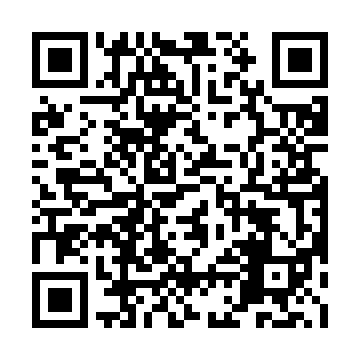
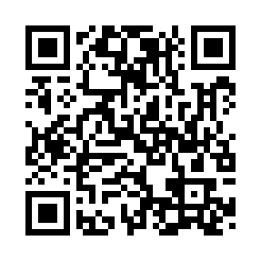

# ❤️ Support dsh-vision-router / 支持项目

  <strong>感谢你愿意支持 dsh-vision-router 的持续开发与维护。</strong> 
  Thank you for supporting the continued development and maintenance of dsh-vision-router.

> [!NOTE]
> **dsh-vision-router 会持续保持免费、开源。** 赞助完全自愿，不会影响功能可用性，也不会换取 Issue / PR 优先级或功能承诺。
>
> **dsh-vision-router will remain free and open source.** Sponsorship is entirely optional and does not buy issue/PR priority or feature commitments.

<table>
  <tr>
    <td align="center" width="50%">
      <strong>微信支付 / WeChat Pay</strong>  
       
      微信扫一扫 · Scan with WeChat
    </td>
    <td align="center" width="50%">
      <strong>支付宝 / Alipay</strong>  
       
      支付宝扫一扫 · Scan with Alipay
    </td>
  </tr>
</table>

## 赞助会用于 / What sponsorship helps with

- 视觉模型、API 与兼容性测试 / vision-model, API, and compatibility testing
- Windows、macOS、Linux 与不同 DSH 版本的回归验证 / cross-platform and DSH-version regression testing
- 文档、示例与社区维护 / documentation, examples, and community maintenance

无论是否赞助，**Star、Issue、PR、Discussion、测试反馈和向其他用户推荐项目都同样重要。** 感谢每一种形式的支持。

Whether or not you sponsor, **stars, issues, pull requests, discussions, testing feedback, and sharing the project are all valuable forms of support.** Thank you.
